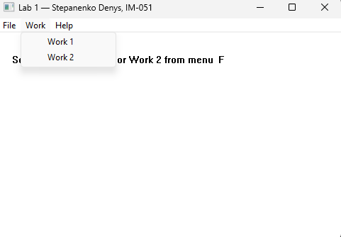
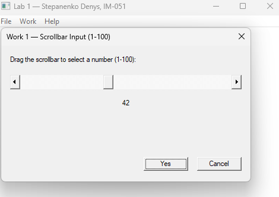
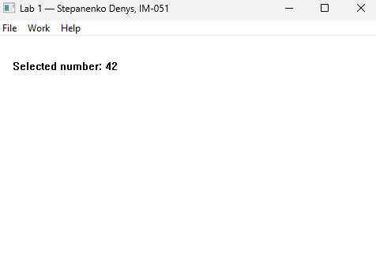
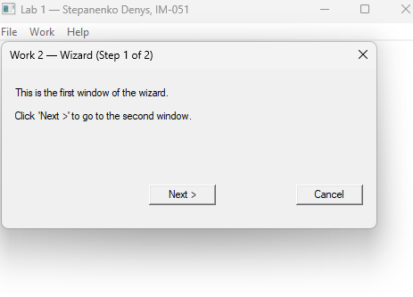
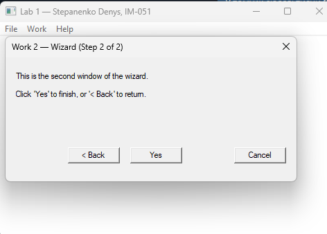
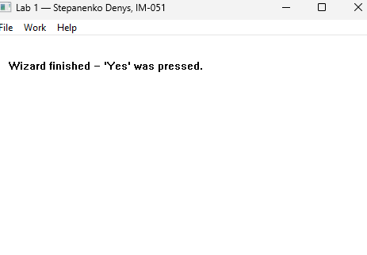

<div style="text-align: center; font-size: 24px; margin-top: 60px;">

Міністерство освіти і науки України

Національний технічний університет України

«Київський політехнічний інститут імені Ігоря Сікорського»

Факультет інформатики та обчислювальної техніки

Кафедра обчислювальної техніки

</div>

<div style="text-align: center; margin-top: 120px;">

<h1 style="font-size: 22px;">Лабораторна робота №1</h1>

<h2 style="font-size: 22px;">з дисципліни «Об'єктно-орієнтоване програмування»</h2>

<h3 style="font-size: 22px; margin-top: 20px;">на тему</h3>

<h2 style="font-size: 22px;">«Знайомство із середовищем розробки програм Microsoft Visual Studio та складання модульних проєктів програм на C++»</h2>

</div>

<div style="text-align: right; margin-top: 120px; font-size: 18px;">

<strong>Виконав:</strong><br>
Степаненко Денис<br>
студент групи IM-051<br>
номер у списку групи: 13<br><br>

<strong>Перевірив:</strong><br>
Рекечинський Дмитро Олександрович

</div>

<div style="text-align: center; margin-top: 120px; font-size: 20px;">

Київ 2026

</div>

---

## Завдання

1. Створити у середовищі MS Visual Studio C++ проєкт з ім'ям Lab1.
2. Написати вихідний текст програми згідно варіанту завдання.
3. Скомпілювати вихідний текст і отримати виконуваний файл програми.
4. Перевірити роботу програми. Налагодити програму.
5. Проаналізувати та прокоментувати результати та вихідний текст програми.

---

## Завдання згідно варіанту

Номер у списку групи: **Ж = 13**

- **В1 = Ж mod 4 = 13 mod 4 = 1** — вікно діалогу з повзунком горизонтального скролінгу (Horizontal Scroll Bar) та двома кнопками: [Так] і [Відміна]. Користувач вводить число від 1 до 100, після натискання [Так] число відображається у головному вікні.
- **В2 = (Ж + 1) mod 4 = 14 mod 4 = 2** — два вікна діалогу, що викликаються послідовно (wizard): перше вікно містить кнопки [Далі>] та [Відміна], друге — [<Назад], [Так] та [Відміна]. Після натискання [Так] у другому вікні у головному вікні виводиться повідомлення про завершення роботи.

Оскільки В2 = 2 (два діалогових вікна), проєкт складається з **трьох незалежних модулів**: module1 — діалог зі скролбаром, module2 — перше вікно візарда, module3 — друге вікно візарда. Кожен модуль реалізовано в окремих файлах `.cpp` / `.h` / `.rc` / `_resource.h` з прихованою callback-функцією (`static`) та власними ресурсами. Інтерфейс модуля — одна функція `extern int Func_MODx(...)`. Логіка переходів візарда реалізована у головному файлі програми — модулі не знають про існування один одного.

---

## Вихідний текст програми

### Головний файл Lab1.cpp

```cpp
// Lab1.cpp - main file
// Lab 1: Modular Win32 project
// Stepanenko Denys, IM-051, 2026

#include <windows.h>
#include <tchar.h>
#include "resource.h"
#include "module1.h"
#include "module2.h"
#include "module3.h"

static TCHAR szWindowClass[] = _T("Lab1WindowClass");
static TCHAR szTitle[] = _T("Lab 1 — Stepanenko Denys, IM-051");

static int   g_number = 0;
static bool  g_showNumber  = false;
static bool  g_wizardDone  = false;

LRESULT CALLBACK WndProc(HWND hWnd, UINT message, WPARAM wParam, LPARAM lParam)
{
    switch (message)
    {
    case WM_COMMAND:
    {
        int wmId = LOWORD(wParam);
        switch (wmId)
        {
        case ID_WORK1:
        {
            int val;
            if (Func_MOD1(hWnd, &val) == 1)
            {
                g_number = val;
                g_showNumber = true;
                g_wizardDone = false;
                InvalidateRect(hWnd, NULL, TRUE);
            }
        }
        break;

        case ID_WORK2:
        {
            // Wizard: module2 = window 1, module3 = window 2
            // Func_MOD2: 1 = Next, 0 = Cancel
            // Func_MOD3: 2 = Yes, -1 = Back, 0 = Cancel
            int r = Func_MOD2(hWnd);
            while (r == 1)
            {
                r = Func_MOD3(hWnd);
                if (r == -1)
                    r = Func_MOD2(hWnd);   // Back - reopen window 1
            }
            if (r == 2)                    // Yes - wizard finished
            {
                g_wizardDone = true;
                g_showNumber = false;
                InvalidateRect(hWnd, NULL, TRUE);
            }
        }
        break;

        case IDM_EXIT:
            DestroyWindow(hWnd);
            break;

        case IDM_ABOUT:
            MessageBox(hWnd,
                _T("Lab 1 — Modular Win32 Project\nStepanenko Denys, IM-051\nVariant: B1=1, B2=2"),
                _T("About"), MB_OK | MB_ICONINFORMATION);
            break;

        default:
            return DefWindowProc(hWnd, message, wParam, lParam);
        }
    }
    break;

    case WM_PAINT:
    {
        PAINTSTRUCT ps;
        HDC hdc = BeginPaint(hWnd, &ps);

        if (g_showNumber)
        {
            TCHAR buf[64];
            _stprintf_s(buf, 64, _T("Selected number: %d"), g_number);
            TextOut(hdc, 20, 30, buf, (int)_tcslen(buf));
        }
        else if (g_wizardDone)
        {
            TextOut(hdc, 20, 30, _T("Wizard finished — 'Yes' was pressed."), 36);
        }
        else
        {
            TextOut(hdc, 20, 30, _T("Select Work -> Work 1 or Work 2 from menu"), 43);
        }

        EndPaint(hWnd, &ps);
    }
    break;

    case WM_DESTROY:
        PostQuitMessage(0);
        break;

    default:
        return DefWindowProc(hWnd, message, wParam, lParam);
    }
    return 0;
}

int APIENTRY _tWinMain(HINSTANCE hInstance, HINSTANCE hPrevInstance,
                       LPTSTR lpCmdLine, int nCmdShow)
{
    UNREFERENCED_PARAMETER(hPrevInstance);
    UNREFERENCED_PARAMETER(lpCmdLine);

    WNDCLASSEX wcex;
    wcex.cbSize        = sizeof(WNDCLASSEX);
    wcex.style         = CS_HREDRAW | CS_VREDRAW;
    wcex.lpfnWndProc   = WndProc;
    wcex.cbClsExtra    = 0;
    wcex.cbWndExtra    = 0;
    wcex.hInstance     = hInstance;
    wcex.hIcon         = LoadIcon(NULL, IDI_APPLICATION);
    wcex.hCursor       = LoadCursor(NULL, IDC_ARROW);
    wcex.hbrBackground = (HBRUSH)(COLOR_WINDOW + 1);
    wcex.lpszMenuName  = MAKEINTRESOURCE(IDR_MAINMENU);
    wcex.lpszClassName = szWindowClass;
    wcex.hIconSm       = LoadIcon(NULL, IDI_APPLICATION);

    if (!RegisterClassEx(&wcex))
    {
        MessageBox(NULL, _T("Failed to register window class"),
                   _T("Error"), MB_OK | MB_ICONERROR);
        return 1;
    }

    HWND hWnd = CreateWindow(
        szWindowClass, szTitle,
        WS_OVERLAPPEDWINDOW,
        CW_USEDEFAULT, CW_USEDEFAULT,
        500, 350,
        NULL, NULL, hInstance, NULL);

    if (!hWnd)
    {
        MessageBox(NULL, _T("Failed to create window"),
                   _T("Error"), MB_OK | MB_ICONERROR);
        return 1;
    }

    ShowWindow(hWnd, nCmdShow);
    UpdateWindow(hWnd);

    MSG msg;
    while (GetMessage(&msg, NULL, 0, 0))
    {
        TranslateMessage(&msg);
        DispatchMessage(&msg);
    }

    return (int)msg.wParam;
}

// LAUNCH (PowerShell):
// cd "F:\VSC projects\OOP_Labs\labs\lab1\code\src"
// .\Lab1.exe
```

### Модуль 1 — module1.h

```cpp
// module1.h — interface for module 1 (Work 1: scrollbar dialog)
#pragma once
#include <windows.h>

extern int Func_MOD1(HWND hWnd, int* outValue);
```

### Модуль 1 — module1.cpp

```cpp
// module1.cpp - Work 1: scrollbar dialog (variant B1 = 1)
// Stepanenko Denys, IM-051

#include <windows.h>
#include <tchar.h>
#include "module1.h"
#include "module1_resource.h"

#define MIN_VAL 1
#define MAX_VAL 100

static int s_currentValue = 50;

static void UpdateValueDisplay(HWND hDlg)
{
    TCHAR buf[16];
    _stprintf_s(buf, 16, _T("%d"), s_currentValue);
    SetDlgItemText(hDlg, IDC_SCROLL_VALUE, buf);
}

static INT_PTR CALLBACK DlgProc1(HWND hDlg, UINT message, WPARAM wParam, LPARAM lParam)
{
    switch (message)
    {
    case WM_INITDIALOG:
        s_currentValue = 50;
        HWND hScroll;
        hScroll = GetDlgItem(hDlg, IDC_SCROLLBAR);
        SetScrollRange(hScroll, SB_CTL, MIN_VAL, MAX_VAL, FALSE);
        SetScrollPos(hScroll, SB_CTL, s_currentValue, TRUE);
        UpdateValueDisplay(hDlg);
        return TRUE;

    case WM_HSCROLL:
    {
        HWND hScroll = (HWND)lParam;
        int scrollCode = LOWORD(wParam);
        int pos = s_currentValue;

        switch (scrollCode)
        {
        case SB_LINELEFT:  pos--; break;
        case SB_LINERIGHT: pos++; break;
        case SB_PAGELEFT:  pos -= 10; break;
        case SB_PAGERIGHT: pos += 10; break;
        case SB_THUMBTRACK:
        case SB_THUMBPOSITION:
            pos = HIWORD(wParam); break;
        }

        if (pos < MIN_VAL) pos = MIN_VAL;
        if (pos > MAX_VAL) pos = MAX_VAL;

        if (pos != s_currentValue)
        {
            s_currentValue = pos;
            SetScrollPos(hScroll, SB_CTL, s_currentValue, TRUE);
            UpdateValueDisplay(hDlg);
        }
    }
    break;

    case WM_COMMAND:
    {
        int wmId = LOWORD(wParam);
        switch (wmId)
        {
        case IDC_BTN_OK:
            EndDialog(hDlg, s_currentValue);
            return TRUE;
        case IDC_BTN_CANCEL:
            EndDialog(hDlg, -1);
            return TRUE;
        }
    }
    break;

    case WM_CLOSE:
        EndDialog(hDlg, -1);
        break;

    default:
        return FALSE;
    }
    return FALSE;
}

int Func_MOD1(HWND hWnd, int* outValue)
{
    INT_PTR result = DialogBox(
        (HINSTANCE)GetWindowLongPtr(hWnd, GWLP_HINSTANCE),
        MAKEINTRESOURCE(IDD_DIALOG1),
        hWnd, DlgProc1);

    if (result == -1)
        return 0;  // Cancel pressed

    *outValue = (int)result;
    return 1;  // OK pressed
}
```

### Модуль 1 — module1.rc

```rc
// module1.rc — dialog resource for module 1 (scrollbar input)
#include <windows.h>
#include "module1_resource.h"

IDD_DIALOG1 DIALOGEX 0, 0, 280, 140
STYLE DS_SETFONT | DS_MODALFRAME | WS_POPUP | WS_CAPTION | WS_SYSMENU
CAPTION "Work 1 — Scrollbar Input (1-100)"
FONT 8, "MS Shell Dlg", 400, 0, 0x1
BEGIN
    LTEXT           "Drag the scrollbar to select a number (1-100):",-1,10,10,260,12
    SCROLLBAR       IDC_SCROLLBAR,10,30,260,15,SBS_HORZ
    CTEXT           "50",IDC_SCROLL_VALUE,10,55,260,14
    PUSHBUTTON      "Yes",IDC_BTN_OK,160,115,50,14
    PUSHBUTTON      "Cancel",IDC_BTN_CANCEL,220,115,50,14
END
```

### Модуль 2 — module2.h

```cpp
// module2.h — interface for module 2 (Work 2: wizard, window 1)
#pragma once
#include <windows.h>

// Returns: 1 = Next, 0 = Cancel
extern int Func_MOD2(HWND hWnd);
```

### Модуль 2 — module2.cpp

```cpp
// module2.cpp - Work 2, wizard window 1 (variant B2 = 2)
// Buttons: [Next >] -> 1, [Cancel]/x -> 0
// Stepanenko Denys, IM-051

#include <windows.h>
#include <tchar.h>
#include "module2.h"
#include "module2_resource.h"

static INT_PTR CALLBACK DlgProc2(HWND hDlg, UINT message, WPARAM wParam, LPARAM lParam)
{
    switch (message)
    {
    case WM_COMMAND:
    {
        int wmId = LOWORD(wParam);
        switch (wmId)
        {
        case IDC_BTN_NEXT:
            EndDialog(hDlg, 1);   // Next - open wizard window 2
            return TRUE;
        case IDC_BTN_CANCEL:
            EndDialog(hDlg, 0);   // Cancel - abort wizard
            return TRUE;
        }
    }
    break;

    case WM_CLOSE:
        EndDialog(hDlg, 0);
        break;

    default:
        return FALSE;
    }
    return FALSE;
}

int Func_MOD2(HWND hWnd)
{
    return (int)DialogBox(
        (HINSTANCE)GetWindowLongPtr(hWnd, GWLP_HINSTANCE),
        MAKEINTRESOURCE(IDD_DIALOG2),
        hWnd, DlgProc2);
}
```

### Модуль 2 — module2.rc

```rc
// module2.rc — dialog resource for module 2 (wizard window 1)
#include <windows.h>
#include "module2_resource.h"

IDD_DIALOG2 DIALOGEX 0, 0, 280, 110
STYLE DS_SETFONT | DS_MODALFRAME | WS_POPUP | WS_CAPTION | WS_SYSMENU
CAPTION "Work 2 — Wizard (Step 1 of 2)"
FONT 8, "MS Shell Dlg", 400, 0, 0x1
BEGIN
    LTEXT           "This is the first window of the wizard.",-1,10,12,260,12
    LTEXT           "Click 'Next >' to go to the second window.",-1,10,28,260,12
    PUSHBUTTON      "Next >",IDC_BTN_NEXT,110,80,50,14
    PUSHBUTTON      "Cancel",IDC_BTN_CANCEL,220,80,50,14
END
```

### Модуль 3 — module3.h

```cpp
// module3.h — interface for module 3 (Work 2: wizard, window 2)
#pragma once
#include <windows.h>

// Returns: 2 = Yes (finish), -1 = Back, 0 = Cancel
extern int Func_MOD3(HWND hWnd);
```

### Модуль 3 — module3.cpp

```cpp
// module3.cpp - Work 2, wizard window 2 (variant B2 = 2)
// Buttons: [Yes] -> 2, [< Back] -> -1, [Cancel]/x -> 0
// Stepanenko Denys, IM-051

#include <windows.h>
#include <tchar.h>
#include "module3.h"
#include "module3_resource.h"

static INT_PTR CALLBACK DlgProc3(HWND hDlg, UINT message, WPARAM wParam, LPARAM lParam)
{
    switch (message)
    {
    case WM_COMMAND:
    {
        int wmId = LOWORD(wParam);
        switch (wmId)
        {
        case IDC_BTN_YES:
            EndDialog(hDlg, 2);   // Yes - wizard finished
            return TRUE;
        case IDC_BTN_BACK:
            EndDialog(hDlg, -1);  // Back - return to wizard window 1
            return TRUE;
        case IDC_BTN_CANCEL:
            EndDialog(hDlg, 0);   // Cancel - abort wizard
            return TRUE;
        }
    }
    break;

    case WM_CLOSE:
        EndDialog(hDlg, 0);
        break;

    default:
        return FALSE;
    }
    return FALSE;
}

int Func_MOD3(HWND hWnd)
{
    return (int)DialogBox(
        (HINSTANCE)GetWindowLongPtr(hWnd, GWLP_HINSTANCE),
        MAKEINTRESOURCE(IDD_DIALOG3),
        hWnd, DlgProc3);
}
```

### Модуль 3 — module3.rc

```rc
// module3.rc — dialog resource for module 3 (wizard window 2)
#include <windows.h>
#include "module3_resource.h"

IDD_DIALOG3 DIALOGEX 0, 0, 280, 110
STYLE DS_SETFONT | DS_MODALFRAME | WS_POPUP | WS_CAPTION | WS_SYSMENU
CAPTION "Work 2 — Wizard (Step 2 of 2)"
FONT 8, "MS Shell Dlg", 400, 0, 0x1
BEGIN
    LTEXT           "This is the second window of the wizard.",-1,10,12,260,12
    LTEXT           "Click 'Yes' to finish, or '< Back' to return.",-1,10,28,260,12
    PUSHBUTTON      "< Back",IDC_BTN_BACK,60,80,50,14
    PUSHBUTTON      "Yes",IDC_BTN_YES,120,80,50,14
    PUSHBUTTON      "Cancel",IDC_BTN_CANCEL,220,80,50,14
END
```

### Головний ресурс — Lab1.rc

```rc
// Lab1.rc — main window resources
#include <windows.h>
#include "resource.h"

IDR_MAINMENU MENU
BEGIN
    POPUP "&File"
    BEGIN
        MENUITEM "E&xit", IDM_EXIT
    END
    POPUP "&Work"
    BEGIN
        MENUITEM "Work &1", ID_WORK1
        MENUITEM "Work &2", ID_WORK2
    END
    POPUP "&Help"
    BEGIN
        MENUITEM "&About", IDM_ABOUT
    END
END
```

---

## Діаграми

### Діаграма залежностей файлів та модулів

```
Lab1.cpp
├── <windows.h>
├── <tchar.h>
├── resource.h
├── module1.h
│   └── <windows.h>
├── module2.h
│   └── <windows.h>
└── module3.h
    └── <windows.h>

module1.cpp
├── <windows.h>
├── <tchar.h>
├── module1.h
└── module1_resource.h

module2.cpp
├── <windows.h>
├── <tchar.h>
├── module2.h
└── module2_resource.h

module3.cpp
├── <windows.h>
├── <tchar.h>
├── module3.h
└── module3_resource.h

Lab1.rc     └── resource.h
module1.rc  └── module1_resource.h
module2.rc  └── module2_resource.h
module3.rc  └── module3_resource.h
```

Перехресних `#include` між модулями немає — кожен модуль незалежний. Логіка переходів візарда знаходиться у головному файлі: `Func_MOD2` повертає 1 (Next) або 0 (Cancel), `Func_MOD3` — 2 (Yes), -1 (Back) або 0 (Cancel). Цикл `while (r == 1)` у обробнику `ID_WORK2` дозволяє рухатись між вікнами візарда у будь-якому напрямку.

---

## Скріншоти

### Головне вікно програми



_Рис. 1. Головне вікно програми з меню File, Work, Help_

---

### Вікно діалогу «Work 1» — скролбар



_Рис. 2. Вікно діалогу модуля 1 — повзунок скролінгу для вводу числа 1–100 (варіант В1=1)_

---

### Результат «Work 1» у головному вікні



_Рис. 3. Виведення вибраного числа у головному вікні_

---

### Візард — перше вікно



_Рис. 4. Перше вікно візарда з кнопками [Next>] та [Cancel] (варіант В2=2)_

---

### Візард — друге вікно



_Рис. 5. Друге вікно візарда з кнопками [<Back], [Yes], [Cancel]_

---

### Результат візарда у головному вікні



_Рис. 6. Повідомлення про завершення візарда у головному вікні_

---

## Висновки

У лабораторній роботі я виконав завдання згідно свого варіанту (Ж = 13). Створено модульний проєкт Lab1, що складається з головного файлу та трьох незалежних модулів. Модуль 1 реалізує вікно діалогу з горизонтальним повзунком скролінгу для вводу числа від 1 до 100 (варіант В1 = 1). Модулі 2 та 3 реалізують два послідовні вікна діалогу-візарда: перше з кнопками [Далі]/[Відміна], друге — з кнопками [Назад]/[Так]/[Відміна] (варіант В2 = 2).

Кожен модуль має власний інтерфейс (одна функція `extern int Func_MODx(...)`), приховану callback-функцію діалогу (`static INT_PTR CALLBACK DlgProcX`), власний файл ресурсів `.rc` та власний заголовок ідентифікаторів ресурсів `_resource.h`. Перехресних `#include`-зв'язків між модулями немає — взаємодія відбувається лише через значення, що повертаються інтерфейсними функціями, а логіка послідовності вікон візарда реалізована у головному файлі програми.

Лабораторна робота дала практичні навички роботи з Windows API: реєстрація класу вікна (`WNDCLASSEX`, `RegisterClassEx`), створення вікна (`CreateWindow`), цикл обробки повідомлень (`GetMessage`, `TranslateMessage`, `DispatchMessage`), обробка повідомлень `WM_COMMAND`, `WM_PAINT`, `WM_HSCROLL`, створення модальних діалогових вікон (`DialogBox`, `EndDialog`), робота з елементами управління (`Scroll Bar`, кнопки, статичний текст), виведення тексту (`TextOut`), а також організація роздільної компіляції модулів.
