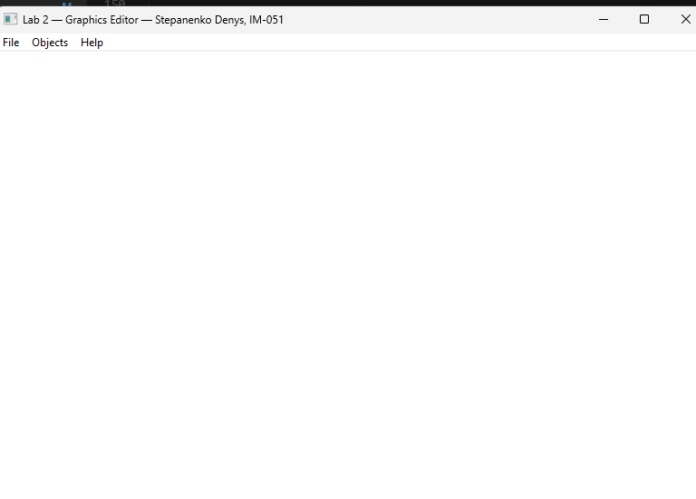
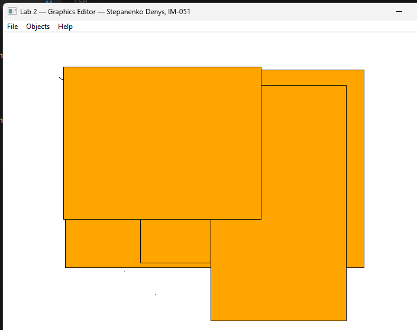

<div style="text-align: center; font-size: 24px; margin-top: 60px;">

Міністерство освіти і науки України

Національний технічний університет України

«Київський політехнічний інститут імені Ігоря Сікорського»

Факультет інформатики та обчислювальної техніки

Кафедра обчислювальної техніки

</div>

<div style="text-align: center; margin-top: 120px;">

<h1 style="font-size: 22px;">Лабораторна робота №2</h1>

<h2 style="font-size: 22px;">з дисципліни «Об'єктно-орієнтоване програмування»</h2>

<h3 style="font-size: 22px; margin-top: 20px;">на тему</h3>

<h2 style="font-size: 22px;">«Розробка графічного редактора об'єктів на C++»</h2>

</div>

<div style="text-align: right; margin-top: 120px; font-size: 18px;">

<strong>Виконав:</strong><br>
Степаненко Денис<br>
студент групи IM-051<br>
номер у списку групи: 16<br><br>

<strong>Перевірив:</strong><br>
Рекечинський Дмитро Олександрович

</div>

<div style="text-align: center; margin-top: 120px; font-size: 20px;">

Київ 2026

</div>

---

## Завдання

1. Створити у середовищі MS Visual Studio C++ проєкт типу Windows Desktop Application з ім'ям Lab2.
2. Скомпілювати проєкт і отримати виконуваний файл програми.
3. Перевірити роботу програми. Налагодити програму.
4. Проаналізувати та прокоментувати результати та вихідний текст програми.
5. Оформити звіт.

---

## Завдання згідно варіанту

Номер у списку групи: **Ж = 16**

| Параметр | Формула | Значення |
|----------|---------|----------|
| Тип масиву | Ж mod 3 = 16 mod 3 | **Статичний масив, N = 116** |
| Стиль "гумового" сліду | Ж mod 4 = 16 mod 4 | **Суцільна чорна лінія** |
| Колір ліній | Ж mod 5 = 16 mod 5 | **Чорний (RGB(0,0,0))** |
| Колір заповнення прямокутника | Ж mod 6 = 16 mod 6 | **Помаранчевий (RGB(255,165,0))** |
| Спосіб вводу прямокутника | Ж mod 2 = 16 mod 2 | **Двома протилежними кутами** |
| Колір заповнення еліпса | Ж mod 5 = 16 mod 5 | **Білий (RGB(255,255,255))** |
| Спосіб вводу еліпса | Ж mod 2 = 16 mod 2 | **Від центру до кута** |
| Позначка типу об'єкта | — | **У меню (checkmarks)** |

---

## Вихідний текст програми

### Головний файл Lab2.cpp

```cpp
#include <windows.h>
#include <tchar.h>
#include "resource.h"
#include "shape.h"
#include "point.h"
#include "line.h"
#include "rect.h"
#include "ellipse.h"

#define N 116

static Shape* pcshape[N];
static int shapeCount = 0;

static int currentType = IDM_POINT;
static bool isDrawing = false;
static Shape* pTempShape = NULL;

static void SetMenuCheckmarks(HWND hWnd, int selectedId)
{
    HMENU hMenu = GetMenu(hWnd);
    CheckMenuItem(hMenu, IDM_POINT,   MF_UNCHECKED);
    CheckMenuItem(hMenu, IDM_LINE,    MF_UNCHECKED);
    CheckMenuItem(hMenu, IDM_RECT,    MF_UNCHECKED);
    CheckMenuItem(hMenu, IDM_ELLIPSE, MF_UNCHECKED);
    CheckMenuItem(hMenu, selectedId,  MF_CHECKED);
}

static Shape* CreateShape(int type, int x1, int y1, int x2, int y2)
{
    switch (type)
    {
    case IDM_POINT:   return new PointShape(x1, y1, x2, y2);
    case IDM_LINE:    return new LineShape(x1, y1, x2, y2);
    case IDM_RECT:    return new RectShape(x1, y1, x2, y2);
    case IDM_ELLIPSE: return new EllipseShape(x1, y1, x2, y2);
    default:          return nullptr;
    }
}

static void DrawAllShapes(HDC hdc)
{
    for (int i = 0; i < shapeCount; i++)
    {
        if (pcshape[i])
            pcshape[i]->Show(hdc);
    }
}

static void DrawRubberBand(HDC hdc, Shape* shape)
{
    int oldROP = SetROP2(hdc, R2_NOTXORPEN);
    HPEN hPen = CreatePen(PS_SOLID, 1, RGB(0, 0, 0));
    HPEN hOldPen = (HPEN)SelectObject(hdc, hPen);

    shape->Show(hdc);

    SelectObject(hdc, hOldPen);
    SetROP2(hdc, oldROP);
    DeleteObject(hPen);
}

LRESULT CALLBACK WndProc(HWND hWnd, UINT message, WPARAM wParam, LPARAM lParam)
{
    switch (message)
    {
    case WM_CREATE:
        SetMenuCheckmarks(hWnd, currentType);
        break;

    case WM_COMMAND:
    {
        int wmId = LOWORD(wParam);
        switch (wmId)
        {
        case IDM_POINT:
        case IDM_LINE:
        case IDM_RECT:
        case IDM_ELLIPSE:
            currentType = wmId;
            SetMenuCheckmarks(hWnd, currentType);
            break;
        case IDM_EXIT:
            DestroyWindow(hWnd);
            break;
        case IDM_ABOUT:
            MessageBox(hWnd,
                _T("Lab 2 — Graphics Editor\nStepanenko Denys, IM-051"),
                _T("About"), MB_OK | MB_ICONINFORMATION);
            break;
        default:
            return DefWindowProc(hWnd, message, wParam, lParam);
        }
    }
    break;

    case WM_LBUTTONDOWN:
    {
        int x = LOWORD(lParam);
        int y = HIWORD(lParam);
        isDrawing = true;
        pTempShape = CreateShape(currentType, x, y, x, y);
    }
    break;

    case WM_MOUSEMOVE:
    {
        if (isDrawing && pTempShape)
        {
            int x = LOWORD(lParam);
            int y = HIWORD(lParam);
            pTempShape->OnMouseMove(x, y);
            InvalidateRect(hWnd, NULL, TRUE);
        }
    }
    break;

    case WM_LBUTTONUP:
    {
        if (isDrawing && pTempShape)
        {
            int x = LOWORD(lParam);
            int y = HIWORD(lParam);
            pTempShape->OnMouseMove(x, y);

            if (shapeCount < N)
            {
                int x1, y1, x2, y2;
                pTempShape->GetCoords(x1, y1, x2, y2);
                pcshape[shapeCount] = CreateShape(currentType, x1, y1, x2, y2);
                shapeCount++;
            }

            delete pTempShape;
            pTempShape = NULL;
            isDrawing = false;
            InvalidateRect(hWnd, NULL, TRUE);
        }
    }
    break;

    case WM_PAINT:
    {
        PAINTSTRUCT ps;
        HDC hdc = BeginPaint(hWnd, &ps);

        DrawAllShapes(hdc);

        if (isDrawing && pTempShape)
            DrawRubberBand(hdc, pTempShape);

        EndPaint(hWnd, &ps);
    }
    break;

    case WM_DESTROY:
        for (int i = 0; i < shapeCount; i++)
            delete pcshape[i];
        if (pTempShape) delete pTempShape;
        PostQuitMessage(0);
        break;

    default:
        return DefWindowProc(hWnd, message, wParam, lParam);
    }
    return 0;
}
```

### Клас Shape — shape.h

```cpp
#pragma once
#include <windows.h>

class Shape
{
protected:
    int x1, y1, x2, y2;

public:
    Shape(int x1, int y1, int x2, int y2)
        : x1(x1), y1(y1), x2(x2), y2(y2) {}

    virtual ~Shape() {}

    virtual void Show(HDC hdc) = 0;
    virtual void OnMouseDown(int x, int y) { x1 = x; y1 = y; x2 = x; y2 = y; }
    virtual void OnMouseMove(int x, int y) { x2 = x; y2 = y; }

    void GetCoords(int& a, int& b, int& c, int& d) const { a = x1; b = y1; c = x2; d = y2; }
};
```

### Клас PointShape — point.h / point.cpp

```cpp
// point.h
#pragma once
#include "shape.h"

class PointShape : public Shape
{
public:
    PointShape(int x1 = 0, int y1 = 0, int x2 = 0, int y2 = 0)
        : Shape(x1, y1, x2, y2) {}

    void Show(HDC hdc) override;
    void OnMouseDown(int x, int y) override { x1 = x; y1 = y; x2 = x; y2 = y; }
    void OnMouseMove(int x, int y) override { /* point doesn't change */ }
};

// point.cpp
void PointShape::Show(HDC hdc)
{
    SetPixel(hdc, x1, y1, RGB(0, 0, 0));
}
```

### Клас LineShape — line.h / line.cpp

```cpp
// line.h
#pragma once
#include "shape.h"

class LineShape : public Shape
{
public:
    LineShape(int x1 = 0, int y1 = 0, int x2 = 0, int y2 = 0)
        : Shape(x1, y1, x2, y2) {}

    void Show(HDC hdc) override;
};

// line.cpp
void LineShape::Show(HDC hdc)
{
    HPEN hPen = CreatePen(PS_SOLID, 1, RGB(0, 0, 0));
    HPEN hOldPen = (HPEN)SelectObject(hdc, hPen);

    MoveToEx(hdc, x1, y1, NULL);
    LineTo(hdc, x2, y2);

    SelectObject(hdc, hOldPen);
    DeleteObject(hPen);
}
```

### Клас RectShape — rect.h / rect.cpp

```cpp
// rect.h
#pragma once
#include "shape.h"

class RectShape : public Shape
{
public:
    RectShape(int x1 = 0, int y1 = 0, int x2 = 0, int y2 = 0)
        : Shape(x1, y1, x2, y2) {}

    void Show(HDC hdc) override;
};

// rect.cpp — orange fill, black outline, input by two corners
void RectShape::Show(HDC hdc)
{
    HBRUSH hBrush = CreateSolidBrush(RGB(255, 165, 0));
    HBRUSH hOldBrush = (HBRUSH)SelectObject(hdc, hBrush);

    HPEN hPen = CreatePen(PS_SOLID, 1, RGB(0, 0, 0));
    HPEN hOldPen = (HPEN)SelectObject(hdc, hPen);

    int left   = (x1 < x2) ? x1 : x2;
    int right  = (x1 < x2) ? x2 : x1;
    int top    = (y1 < y2) ? y1 : y2;
    int bottom = (y1 < y2) ? y2 : y1;

    Rectangle(hdc, left, top, right, bottom);

    SelectObject(hdc, hOldPen);
    SelectObject(hdc, hOldBrush);
    DeleteObject(hPen);
    DeleteObject(hBrush);
}
```

### Клас EllipseShape — ellipse.h / ellipse.cpp

```cpp
// ellipse.h
#pragma once
#include "shape.h"

class EllipseShape : public Shape
{
public:
    EllipseShape(int x1 = 0, int y1 = 0, int x2 = 0, int y2 = 0)
        : Shape(x1, y1, x2, y2) {}

    void Show(HDC hdc) override;
    void OnMouseDown(int x, int y) override;
    void OnMouseMove(int x, int y) override;
};

// ellipse.cpp — white fill, black outline, input from center to corner
void EllipseShape::OnMouseDown(int x, int y)
{
    x1 = x; y1 = y;  // center
    x2 = x; y2 = y;
}

void EllipseShape::OnMouseMove(int x, int y)
{
    x2 = x; y2 = y;  // corner
}

void EllipseShape::Show(HDC hdc)
{
    HBRUSH hBrush = CreateSolidBrush(RGB(255, 255, 255));
    HBRUSH hOldBrush = (HBRUSH)SelectObject(hdc, hBrush);

    HPEN hPen = CreatePen(PS_SOLID, 1, RGB(0, 0, 0));
    HPEN hOldPen = (HPEN)SelectObject(hdc, hPen);

    int left   = 2 * x1 - x2;
    int top    = 2 * y1 - y2;
    int right  = x2;
    int bottom = y2;

    if (left > right) { int t = left; left = right; right = t; }
    if (top > bottom) { int t = top; top = bottom; bottom = t; }

    Ellipse(hdc, left, top, right, bottom);

    SelectObject(hdc, hOldPen);
    SelectObject(hdc, hOldBrush);
    DeleteObject(hPen);
    DeleteObject(hBrush);
}
```

---

## Діаграми

### Діаграма залежностей файлів та модулів

```
Lab2.cpp
├── <windows.h>
├── <tchar.h>
├── resource.h
├── shape.h
│   └── <windows.h>
├── point.h
│   └── shape.h
├── line.h
│   └── shape.h
├── rect.h
│   └── shape.h
└── ellipse.h
    └── shape.h

point.cpp    ├── point.h
line.cpp     ├── line.h
rect.cpp     ├── rect.h
ellipse.cpp  ├── ellipse.h
shape.cpp    ├── shape.h

Lab2.rc
└── resource.h
```

### Діаграма класів (UML)

```
┌─────────────────────────────┐
│      Shape (abstract)       │
├─────────────────────────────┤
│ # x1, y1, x2, y2: int       │
├─────────────────────────────┤
│ + Shape(x1,y1,x2,y2)        │
│ + virtual ~Shape()          │
│ + virtual Show(HDC) = 0     │
│ + virtual OnMouseDown(x,y)  │
│ + virtual OnMouseMove(x,y)  │
│ + GetCoords(a,b,c,d)        │
└──────────────┬──────────────┘
               │ extends
   ┌───────────┼───────────┬───────────────┐
   │           │           │               │
┌──▼──────┐ ┌──▼──────┐ ┌──▼───────┐ ┌────▼──────┐
│PointShape│ │LineShape│ │RectShape │ │EllipseShp │
├──────────┤ ├──────────┤ ├──────────┤ ├───────────┤
│          │ │          │ │          │ │           │
├──────────┤ ├──────────┤ ├──────────┤ ├───────────┤
│+Show(HDC)│ │+Show(HDC)│ │+Show(HDC)│ │+Show(HDC) │
│  SetPixel│ │  MoveTo  │ │  Rectang │ │  Ellipse  │
│          │ │  LineTo  │ │  orange  │ │  white    │
│+OnMouseDn│ │          │ │  fill    │ │  fill     │
│+OnMouseMv│ │          │ │  2 corners│ │ center→   │
│ (no move)│ │          │ │          │ │  corner   │
└──────────┘ └──────────┘ └──────────┘ └───────────┘
```

---

## Скріншоти

### Головне вікно редактора



_Рис. 1. Головне вікно графічного редактора з меню «Об'єкти»_

---

### Малювання крапки



_Рис. 2. Малювання крапки (PointShape)_

---

### Малювання лінії з «гумовим» слідом


_Рис. 3. Малювання лінії з суцільним чорним «гумовим» слідом_

---

### Малювання прямокутника


_Рис. 4. Малювання прямокутника з помаранчевим заповненням (ввід двома кутами)_

---

### Малювання еліпса


_Рис. 5. Малювання еліпса з білим заповненням (ввід від центру до кута)_

---

## Висновки

У лабораторній роботі я виконав завдання згідно свого варіанту (Ж = 16). Створено графічний редактор об'єктів з використанням об'єктно-орієнтованого підходу. Реалізовано ієрархію класів з абстрактним базовим класом `Shape` та похідними класами `PointShape`, `LineShape`, `RectShape`, `EllipseShape`.

Поліморфізм забезпечується віртуальними функціями `Show()`, `OnMouseDown()`, `OnMouseMove()` — кожен похідний клас реалізує їх по-своєму. Масив вказівників на `Shape*` дозволяє зберігати об'єкти різних типів у одному масиві та поліморфно викликати `Show()` для перемальовування.

Інкапсуляція реалізована через `protected`-поля координат та `public`-інтерфейс класу. «Гумовий» слід реалізовано через `R2_NOTXORPEN` режим малювання — суцільна чорна лінія згідно варіанту.

Лабораторна робота дала практичні навички використання успадкування, поліморфізму та абстракції в C++, а також роботу з графікою Windows API (`HDC`, `SelectObject`, `Rectangle`, `Ellipse`, `MoveToEx`, `LineTo`).
