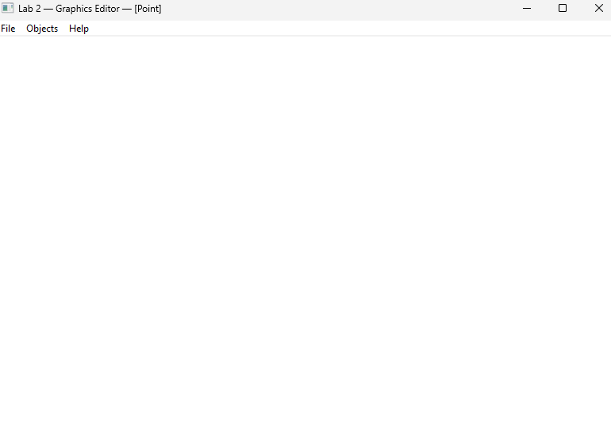
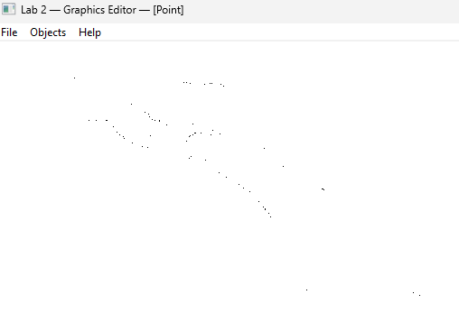
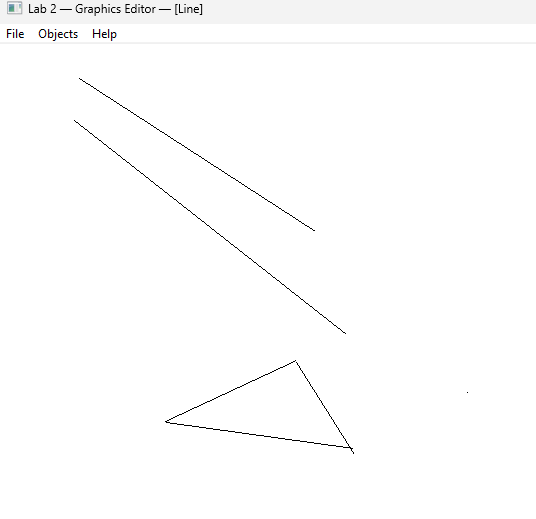
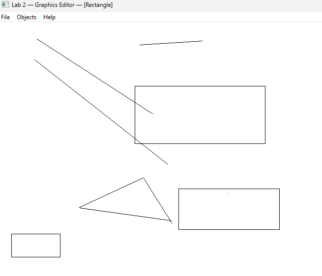
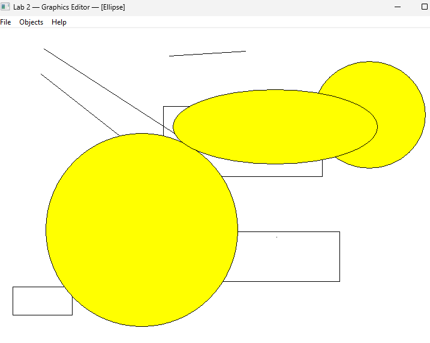

<div style="text-align: center; font-size: 24px; margin-top: 60px;">

Міністерство освіти і науки України

Національний технічний університет України

«Київський політехнічний інститут імені Ігоря Сікорського»

Факультет інформатики та обчислювальної техніки

Кафедра обчислювальної техніки

</div>

<div style="text-align: center; margin-top: 120px;">

<h1 style="font-size: 22px;">Лабораторна робота №2</h1>

<h2 style="font-size: 22px;">з дисципліни «Об'єктно-орієнтоване програмування»</h2>

<h3 style="font-size: 22px; margin-top: 20px;">на тему</h3>

<h2 style="font-size: 22px;">«Розробка графічного редактора об'єктів на C++»</h2>

</div>

<div style="text-align: right; margin-top: 120px; font-size: 18px;">

<strong>Виконав:</strong><br>
Степаненко Денис<br>
студент групи IM-051<br>
номер у списку групи: 13<br><br>

<strong>Перевірив:</strong><br>
Рекечинський Дмитро Олександрович

</div>

<div style="text-align: center; margin-top: 120px; font-size: 20px;">

Київ 2026

</div>

---

## Завдання

1. Створити у середовищі MS Visual Studio C++ проєкт типу Windows Desktop Application з ім'ям Lab2.
2. Скомпілювати проєкт і отримати виконуваний файл програми.
3. Перевірити роботу програми. Налагодити програму.
4. Проаналізувати та прокоментувати результати та вихідний текст програми.
5. Оформити звіт.

---

## Завдання згідно варіанту

Номер у списку групи: **Ж = 13**

| Параметр | Формула | Значення |
|----------|---------|----------|
| Тип масиву | Ж mod 3 = 13 mod 3 = 1 | **Статичний масив, N = 113** |
| Стиль "гумового" сліду | Ж mod 4 = 13 mod 4 = 1 | **Суцільна червона лінія (RGB(255,0,0))** |
| Спосіб вводу прямокутника | Ж mod 2 = 13 mod 2 = 1 | **Від центру до кута** |
| Заповнення прямокутника | Ж mod 5 = 13 mod 5 = 3 | **Без заповнення (NULL_BRUSH)** |
| Спосіб вводу еліпса | Ж mod 2 = 13 mod 2 = 1 | **Двома протилежними кутами** |
| Заповнення еліпса | Ж mod 5 = 13 mod 5 = 3 | **Кольорове заповнення** |
| Колір заповнення еліпса | Ж mod 6 = 13 mod 6 = 1 | **Жовтий (RGB(255,255,0))** |
| Позначка типу об'єкта | Ж mod 2 = 13 mod 2 = 1 | **У заголовку вікна** |

Фігури: крапка, лінія, прямокутник, еліпс — вибір через меню Objects. Введення мишею: натискання–тягання–відпускання. Під час тягання відображається «гумовий» слід.

---

## Вихідний текст програми

### Головний файл Lab2.cpp

```cpp
// Lab2.cpp - main file
// Lab 2: Graphics editor with Shape hierarchy
// Stepanenko Denys, IM-051, 2026
// Variant: J=13, static array N=113, solid red rubber band,
//   rect: center->corner + no fill, ellipse: 2 corners + yellow fill,
//   type indicator in window title

#include <windows.h>
#include <tchar.h>
#include "resource.h"
#include "shape.h"
#include "point.h"
#include "line.h"
#include "rect.h"
#include "ellipse.h"

#define N 113

static TCHAR szWindowClass[] = _T("Lab2WindowClass");
static TCHAR szTitle[] = _T("Lab 2 — Graphics Editor — Stepanenko Denys, IM-051");

static Shape* pcshape[N];
static int shapeCount = 0;

static int currentType = IDM_POINT;
static bool isDrawing = false;
static Shape* pTempShape = NULL;

static const TCHAR* TypeName(int id)
{
    switch (id)
    {
    case IDM_POINT:   return _T("Point");
    case IDM_LINE:    return _T("Line");
    case IDM_RECT:    return _T("Rectangle");
    case IDM_ELLIPSE: return _T("Ellipse");
    default:          return _T("?");
    }
}

// Type marker in window title (13 mod 2 = 1)
static void UpdateTitle(HWND hWnd)
{
    TCHAR buf[128];
    _stprintf_s(buf, 128, _T("Lab 2 — Graphics Editor — [%s]"), TypeName(currentType));
    SetWindowText(hWnd, buf);
}

static Shape* CreateShape(int type, int x1, int y1, int x2, int y2)
{
    switch (type)
    {
    case IDM_POINT:   return new PointShape(x1, y1, x2, y2);
    case IDM_LINE:    return new LineShape(x1, y1, x2, y2);
    case IDM_RECT:    return new RectShape(x1, y1, x2, y2);
    case IDM_ELLIPSE: return new EllipseShape(x1, y1, x2, y2);
    default:          return nullptr;
    }
}

static void DrawAllShapes(HDC hdc)
{
    for (int i = 0; i < shapeCount; i++)
    {
        if (pcshape[i])
            pcshape[i]->Show(hdc);
    }
}

static void DrawRubberBand(HDC hdc, Shape* shape)
{
    // Variant: solid red line (13 mod 4 = 1)
    int oldROP = SetROP2(hdc, R2_NOTXORPEN);
    HPEN hPen = CreatePen(PS_SOLID, 1, RGB(255, 0, 0));
    HPEN hOldPen = (HPEN)SelectObject(hdc, hPen);

    shape->Show(hdc);

    SelectObject(hdc, hOldPen);
    SetROP2(hdc, oldROP);
    DeleteObject(hPen);
}

LRESULT CALLBACK WndProc(HWND hWnd, UINT message, WPARAM wParam, LPARAM lParam)
{
    switch (message)
    {
    case WM_CREATE:
        UpdateTitle(hWnd);
        break;

    case WM_COMMAND:
    {
        int wmId = LOWORD(wParam);
        switch (wmId)
        {
        case IDM_POINT:
        case IDM_LINE:
        case IDM_RECT:
        case IDM_ELLIPSE:
            currentType = wmId;
            UpdateTitle(hWnd);
            break;
        case IDM_EXIT:
            DestroyWindow(hWnd);
            break;
        case IDM_ABOUT:
            MessageBox(hWnd,
                _T("Lab 2 — Graphics Editor\nStepanenko Denys, IM-051\nJ=13: static array, red rubber band, no-fill rect, yellow ellipse"),
                _T("About"), MB_OK | MB_ICONINFORMATION);
            break;
        default:
            return DefWindowProc(hWnd, message, wParam, lParam);
        }
    }
    break;

    case WM_LBUTTONDOWN:
    {
        int x = LOWORD(lParam);
        int y = HIWORD(lParam);
        isDrawing = true;
        pTempShape = CreateShape(currentType, x, y, x, y);
        SetCapture(hWnd);
    }
    break;

    case WM_MOUSEMOVE:
    {
        if (isDrawing && pTempShape)
        {
            int x = LOWORD(lParam);
            int y = HIWORD(lParam);
            pTempShape->OnMouseMove(x, y);
            InvalidateRect(hWnd, NULL, FALSE);
        }
    }
    break;

    case WM_LBUTTONUP:
    {
        if (isDrawing && pTempShape)
        {
            int x = LOWORD(lParam);
            int y = HIWORD(lParam);
            pTempShape->OnMouseMove(x, y);

            if (shapeCount < N)
            {
                int x1, y1, x2, y2;
                pTempShape->GetCoords(x1, y1, x2, y2);
                pcshape[shapeCount] = CreateShape(currentType, x1, y1, x2, y2);
                shapeCount++;
            }

            delete pTempShape;
            pTempShape = NULL;
            isDrawing = false;
            ReleaseCapture();
            InvalidateRect(hWnd, NULL, FALSE);
        }
    }
    break;

    case WM_ERASEBKGND:
        return 1;

    case WM_PAINT:
    {
        PAINTSTRUCT ps;
        HDC hdc = BeginPaint(hWnd, &ps);

        RECT rc;
        GetClientRect(hWnd, &rc);
        HDC hdcMem = CreateCompatibleDC(hdc);
        HBITMAP hbmMem = CreateCompatibleBitmap(hdc, rc.right, rc.bottom);
        HBITMAP hbmOld = (HBITMAP)SelectObject(hdcMem, hbmMem);

        HBRUSH hBrush = CreateSolidBrush(GetSysColor(COLOR_WINDOW));
        FillRect(hdcMem, &rc, hBrush);
        DeleteObject(hBrush);

        DrawAllShapes(hdcMem);

        if (isDrawing && pTempShape)
            DrawRubberBand(hdcMem, pTempShape);

        BitBlt(hdc, 0, 0, rc.right, rc.bottom, hdcMem, 0, 0, SRCCOPY);

        SelectObject(hdcMem, hbmOld);
        DeleteObject(hbmMem);
        DeleteDC(hdcMem);
        EndPaint(hWnd, &ps);
    }
    break;

    case WM_DESTROY:
        for (int i = 0; i < shapeCount; i++)
            delete pcshape[i];
        if (pTempShape) delete pTempShape;
        PostQuitMessage(0);
        break;

    default:
        return DefWindowProc(hWnd, message, wParam, lParam);
    }
    return 0;
}

int APIENTRY _tWinMain(HINSTANCE hInstance, HINSTANCE hPrevInstance,
                       LPTSTR lpCmdLine, int nCmdShow)
{
    UNREFERENCED_PARAMETER(hPrevInstance);
    UNREFERENCED_PARAMETER(lpCmdLine);

    WNDCLASSEX wcex;
    wcex.cbSize        = sizeof(WNDCLASSEX);
    wcex.style         = CS_HREDRAW | CS_VREDRAW;
    wcex.lpfnWndProc   = WndProc;
    wcex.cbClsExtra    = 0;
    wcex.cbWndExtra    = 0;
    wcex.hInstance     = hInstance;
    wcex.hIcon         = LoadIcon(NULL, IDI_APPLICATION);
    wcex.hCursor       = LoadCursor(NULL, IDC_ARROW);
    wcex.hbrBackground = (HBRUSH)(COLOR_WINDOW + 1);
    wcex.lpszMenuName  = MAKEINTRESOURCE(IDR_MAINMENU);
    wcex.lpszClassName = szWindowClass;
    wcex.hIconSm       = LoadIcon(NULL, IDI_APPLICATION);

    if (!RegisterClassEx(&wcex))
    {
        MessageBox(NULL, _T("Failed to register window class"),
                   _T("Error"), MB_OK | MB_ICONERROR);
        return 1;
    }

    HWND hWnd = CreateWindow(
        szWindowClass, szTitle,
        WS_OVERLAPPEDWINDOW | WS_CLIPCHILDREN,
        CW_USEDEFAULT, CW_USEDEFAULT,
        800, 600,
        NULL, NULL, hInstance, NULL);

    if (!hWnd)
    {
        MessageBox(NULL, _T("Failed to create window"),
                   _T("Error"), MB_OK | MB_ICONERROR);
        return 1;
    }

    ShowWindow(hWnd, nCmdShow);
    UpdateWindow(hWnd);

    MSG msg;
    while (GetMessage(&msg, NULL, 0, 0))
    {
        TranslateMessage(&msg);
        DispatchMessage(&msg);
    }

    return (int)msg.wParam;
}

// LAUNCH (PowerShell):
// cd "F:\VSC projects\OOP_Labs\labs\lab2\code\src"
// .\Lab2.exe
```

### Клас Shape — shape.h / shape.cpp

```cpp
// shape.h — abstract base class for geometric shapes
#pragma once
#include <windows.h>

class Shape
{
protected:
    int x1, y1, x2, y2;

public:
    Shape(int x1, int y1, int x2, int y2)
        : x1(x1), y1(y1), x2(x2), y2(y2) {}

    virtual ~Shape() {}

    virtual void Show(HDC hdc) = 0;
    virtual void OnMouseDown(int x, int y) { x1 = x; y1 = y; x2 = x; y2 = y; }
    virtual void OnMouseMove(int x, int y) { x2 = x; y2 = y; }

    void GetCoords(int& a, int& b, int& c, int& d) const { a = x1; b = y1; c = x2; d = y2; }
};
```

```cpp
// shape.cpp — base class implementation (no concrete code, abstract class)
#include "shape.h"
// Shape is abstract — no direct instantiation
```

### Клас PointShape — point.h / point.cpp

```cpp
// point.h — Point shape
#pragma once
#include "shape.h"

class PointShape : public Shape
{
public:
    PointShape(int x1 = 0, int y1 = 0, int x2 = 0, int y2 = 0)
        : Shape(x1, y1, x2, y2) {}

    void Show(HDC hdc) override;
    void OnMouseDown(int x, int y) override { x1 = x; y1 = y; x2 = x; y2 = y; }
    void OnMouseMove(int x, int y) override { /* point doesn't change */ }
};
```

```cpp
// point.cpp — Point shape implementation
#include "point.h"

void PointShape::Show(HDC hdc)
{
    HBRUSH hBrush = CreateSolidBrush(RGB(0, 0, 0));
    HBRUSH hOldBrush = (HBRUSH)SelectObject(hdc, hBrush);
    HPEN hPen = CreatePen(PS_SOLID, 1, RGB(0, 0, 0));
    HPEN hOldPen = (HPEN)SelectObject(hdc, hPen);

    Ellipse(hdc, x1 - 3, y1 - 3, x1 + 3, y1 + 3);

    SelectObject(hdc, hOldPen);
    SelectObject(hdc, hOldBrush);
    DeleteObject(hPen);
    DeleteObject(hBrush);
}
```

### Клас LineShape — line.h / line.cpp

```cpp
// line.h — Line shape
#pragma once
#include "shape.h"

class LineShape : public Shape
{
public:
    LineShape(int x1 = 0, int y1 = 0, int x2 = 0, int y2 = 0)
        : Shape(x1, y1, x2, y2) {}

    void Show(HDC hdc) override;
};
```

```cpp
// line.cpp — Line shape implementation
#include "line.h"

void LineShape::Show(HDC hdc)
{
    HPEN hPen = CreatePen(PS_SOLID, 1, RGB(0, 0, 0));
    HPEN hOldPen = (HPEN)SelectObject(hdc, hPen);

    MoveToEx(hdc, x1, y1, NULL);
    LineTo(hdc, x2, y2);

    SelectObject(hdc, hOldPen);
    DeleteObject(hPen);
}
```

### Клас RectShape — rect.h / rect.cpp

```cpp
// rect.h — Rectangle shape
#pragma once
#include "shape.h"

class RectShape : public Shape
{
public:
    RectShape(int x1 = 0, int y1 = 0, int x2 = 0, int y2 = 0)
        : Shape(x1, y1, x2, y2) {}

    void Show(HDC hdc) override;
};
```

```cpp
// rect.cpp — Rectangle shape implementation
// Variant: black outline, no fill (13 mod 5 = 3)
// Input: from center to corner (13 mod 2 = 1)
#include "rect.h"

void RectShape::Show(HDC hdc)
{
    HBRUSH hOldBrush = (HBRUSH)SelectObject(hdc, GetStockObject(NULL_BRUSH));

    HPEN hPen = CreatePen(PS_SOLID, 1, RGB(0, 0, 0));
    HPEN hOldPen = (HPEN)SelectObject(hdc, hPen);

    // input: center -> corner
    int left   = 2 * x1 - x2;
    int top    = 2 * y1 - y2;
    int right  = x2;
    int bottom = y2;

    // Normalize
    if (left > right)  { int t = left;   left = right;   right = t; }
    if (top > bottom)  { int t = top;    top = bottom;   bottom = t; }

    Rectangle(hdc, left, top, right, bottom);

    SelectObject(hdc, hOldPen);
    SelectObject(hdc, hOldBrush);
    DeleteObject(hPen);
}
```

### Клас EllipseShape — ellipse.h / ellipse.cpp

```cpp
// ellipse.h — Ellipse shape
#pragma once
#include "shape.h"

class EllipseShape : public Shape
{
public:
    EllipseShape(int x1 = 0, int y1 = 0, int x2 = 0, int y2 = 0)
        : Shape(x1, y1, x2, y2) {}

    void Show(HDC hdc) override;
};
```

```cpp
// ellipse.cpp — Ellipse shape implementation
// Variant: black outline + yellow fill (13 mod 5 = 3 -> color fill, 13 mod 6 = 1 -> yellow)
// Input: by two corners of bounding rectangle (13 mod 2 = 1)
#include "ellipse.h"

void EllipseShape::Show(HDC hdc)
{
    HBRUSH hBrush = CreateSolidBrush(RGB(255, 255, 0));
    HBRUSH hOldBrush = (HBRUSH)SelectObject(hdc, hBrush);

    HPEN hPen = CreatePen(PS_SOLID, 1, RGB(0, 0, 0));
    HPEN hOldPen = (HPEN)SelectObject(hdc, hPen);

    int left   = (x1 < x2) ? x1 : x2;
    int right  = (x1 < x2) ? x2 : x1;
    int top    = (y1 < y2) ? y1 : y2;
    int bottom = (y1 < y2) ? y2 : y1;

    Ellipse(hdc, left, top, right, bottom);

    SelectObject(hdc, hOldPen);
    SelectObject(hdc, hOldBrush);
    DeleteObject(hPen);
    DeleteObject(hBrush);
}
```

### Головний ресурс — Lab2.rc

```rc
// Lab2.rc — main window resources
#include <windows.h>
#include "resource.h"

IDR_MAINMENU MENU
BEGIN
    POPUP "&File"
    BEGIN
        MENUITEM "E&xit", IDM_EXIT
    END
    POPUP "&Objects"
    BEGIN
        MENUITEM "&Point",        IDM_POINT
        MENUITEM "&Line",         IDM_LINE
        MENUITEM "&Rectangle",    IDM_RECT
        MENUITEM "&Ellipse",      IDM_ELLIPSE
    END
    POPUP "&Help"
    BEGIN
        MENUITEM "&About", IDM_ABOUT
    END
END
```

---

## Діаграми

### Діаграма залежностей файлів та модулів

```
Lab2.cpp
├── <windows.h>
├── <tchar.h>
├── resource.h
├── shape.h
│   └── <windows.h>
├── point.h
│   └── shape.h
├── line.h
│   └── shape.h
├── rect.h
│   └── shape.h
└── ellipse.h
    └── shape.h

point.cpp    ├── point.h
line.cpp     ├── line.h
rect.cpp     ├── rect.h
ellipse.cpp  ├── ellipse.h
shape.cpp    ├── shape.h

Lab2.rc
└── resource.h
```

### Діаграма класів (UML)

```
┌─────────────────────────────┐
│      Shape (abstract)       │
├─────────────────────────────┤
│ # x1, y1, x2, y2: int       │
├─────────────────────────────┤
│ + Shape(x1,y1,x2,y2)        │
│ + virtual ~Shape()          │
│ + virtual Show(HDC) = 0     │
│ + virtual OnMouseDown(x,y)  │
│ + virtual OnMouseMove(x,y)  │
│ + GetCoords(a,b,c,d)        │
└──────────────┬──────────────┘
               │ extends
   ┌───────────┼───────────┬───────────────┐
   │           │           │               │
┌──▼──────┐ ┌──▼──────┐ ┌──▼─────────┐ ┌──▼─────────┐
│PointShape│ │LineShape│ │ RectShape  │ │EllipseShape│
├──────────┤ ├──────────┤ ├────────────┤ ├────────────┤
│          │ │          │ │            │ │            │
├──────────┤ ├──────────┤ ├────────────┤ ├────────────┤
│+Show(HDC)│ │+Show(HDC)│ │+Show(HDC)  │ │+Show(HDC)  │
│  Ellipse │ │  MoveTo  │ │  Rectangle │ │  Ellipse   │
│          │ │  LineTo  │ │  no fill   │ │  yellow    │
│+OnMouseDn│ │          │ │  NULL_BRUSH│ │  fill      │
│+OnMouseMv│ │          │ │ center->   │ │ 2 corners  │
│ (no move)│ │          │ │  corner    │ │            │
└──────────┘ └──────────┘ └────────────┘ └────────────┘
```

---

## Скріншоти

### Головне вікно редактора



_Рис. 1. Головне вікно графічного редактора; у заголовку — позначка поточного типу об'єкта [Point]_

---

### Малювання крапки



_Рис. 2. Малювання крапок (PointShape)_

---

### Малювання лінії



_Рис. 3. Малювання ліній (LineShape)_

---

### Малювання прямокутника



_Рис. 4. Прямокутники без заповнення; ввід від центру до кута (варіант)_

---

### Малювання еліпса



_Рис. 5. Еліпси з жовтим заповненням; ввід двома протилежними кутами (варіант)_

---

## Висновки

У лабораторній роботі я виконав завдання згідно свого варіанту (Ж = 13). Створено графічний редактор об'єктів з використанням об'єктно-орієнтованого підходу. Реалізовано ієрархію класів з абстрактним базовим класом `Shape` та похідними класами `PointShape`, `LineShape`, `RectShape`, `EllipseShape`.

Поліморфізм забезпечується віртуальними функціями `Show()`, `OnMouseDown()`, `OnMouseMove()` — кожен похідний клас реалізує їх по-своєму. Статичний масив вказівників `Shape* pcshape[113]` (13 mod 3 = 1) дозволяє зберігати об'єкти різних типів у одному масиві та поліморфно викликати `Show()` для перемальовування.

Параметри варіанта реалізовано так: «гумовий» слід — суцільна червона лінія (13 mod 4 = 1) через режим `R2_NOTXORPEN`; прямокутник вводиться від центру до кута та малюється без заповнення (`NULL_BRUSH`); еліпс вводиться двома протилежними кутами та має жовте заповнення (13 mod 6 = 1); позначка поточного типу об'єкта виводиться у заголовку вікна через `SetWindowText` (13 mod 2 = 1).

Для усунення блимання при перемальовуванні застосовано подвійну буферизацію: фігури малюються у контексті пам'яті (`CreateCompatibleDC`/`CreateCompatibleBitmap`) і виводяться однією операцією `BitBlt`, а обробник `WM_ERASEBKGND` повертає 1, забороняючи стандартне стирання фону.

Лабораторна робота дала практичні навички використання успадкування, поліморфізму та абстракції в C++, а також роботу з графікою Windows API (`HDC`, `HPEN`, `HBRUSH`, `SelectObject`, `Rectangle`, `Ellipse`, `MoveToEx`, `LineTo`, `SetROP2`, `BitBlt`).
