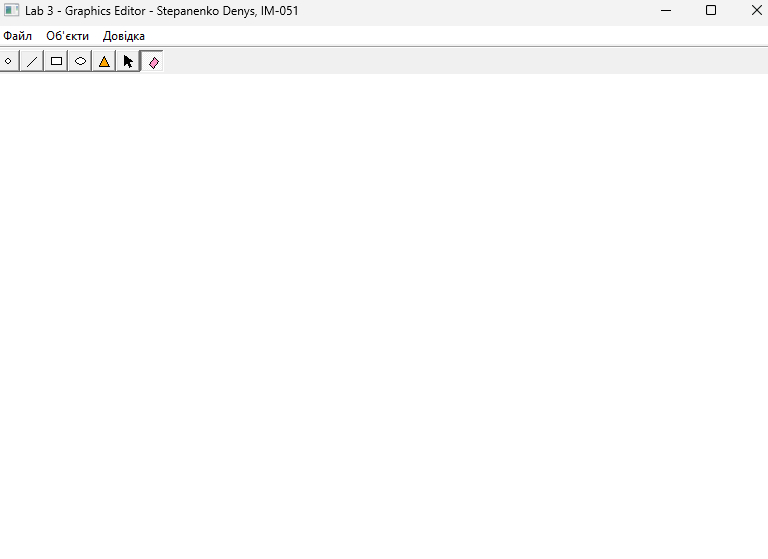
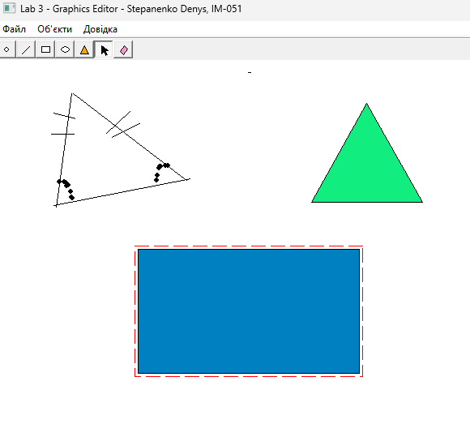
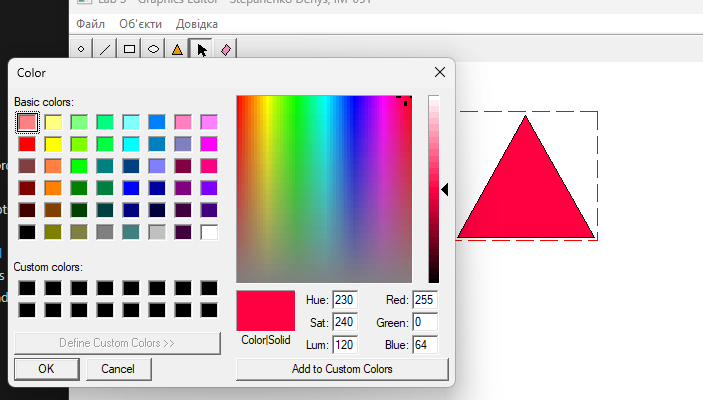
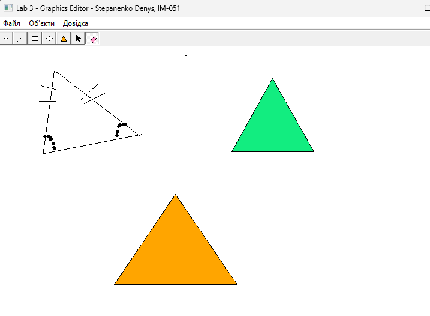

<div style="text-align: center; font-size: 24px; margin-top: 60px;">

Міністерство освіти і науки України

Національний технічний університет України

«Київський політехнічний інститут імені Ігоря Сікорського»

Факультет інформатики та обчислювальної техніки

Кафедра обчислювальної техніки

</div>

<div style="text-align: center; margin-top: 120px;">

<h1 style="font-size: 22px;">Лабораторна робота №3</h1>

<h2 style="font-size: 22px;">з дисципліни «Об'єктно-орієнтоване програмування»</h2>

<h3 style="font-size: 22px; margin-top: 20px;">на тему</h3>

<h2 style="font-size: 22px;">«Розробка інтерфейсу користувача на C++»</h2>

</div>

<div style="text-align: right; margin-top: 120px; font-size: 18px;">

<strong>Виконав:</strong><br>
Степаненко Денис<br>
студент групи IM-051<br>
номер у списку групи: 13<br><br>

<strong>Перевірив:</strong><br>
Рекечинський Дмитро Олександрович

</div>

<div style="text-align: center; margin-top: 120px; font-size: 20px;">

Київ 2026

</div>

---

## Завдання

1. Створити у середовищі MS Visual Studio C++ проєкт типу Win32 з ім'ям Lab3.
2. Написати вихідний текст програми згідно варіанту завдання.
3. Скомпілювати вихідний текст і отримати виконуваний файл програми.
4. Перевірити роботу програми. Налагодити програму.
5. Проаналізувати та прокоментувати результати та вихідний текст програми.
6. Оформити звіт.

---

## Завдання згідно варіанту

Номер у списку групи для Lab3: **Ж = Жлаб2 + 1 = 14**

| Параметр | Обчислення | Результат |
|----------|-----------|-----------|
| Тип масиву `pcshape` | 14 mod 3 = 2 | статичний масив `Shape* pcshape[114]` |
| «Гумовий» слід | 14 mod 4 = 2 | суцільна лінія **синього** кольору |
| Увід прямокутника | 14 mod 2 = 0 | по двох протилежних кутах |
| Відображення прямокутника | 14 mod 5 = 4 | чорний контур **без заповнення** |
| Увід еліпса | 14 mod 2 = 0 | від центру до кута охоплюючого прямокутника |
| Відображення еліпса | 14 mod 5 = 4 → кольорове; 14 mod 6 = 2 | **світло-зелене** заповнення |
| Позначка типу об'єкта | 14 mod 2 = 0 | в меню через `OnInitMenuPopup` |

Вимоги специфікації: Toolbar з кнопками за типами об'єктів, кнопки дублюють
підпункти меню «Об'єкти» та мають підказки (tooltips); усі методи-обробники
повідомлень — функції-члени класу; меню «Об'єкти» між «Файл» і «Довідка»,
підпункти українською; у звіті — діаграма класів.

Додатково реалізовано: п'ятий тип об'єкта (трикутник із помаранчевим
заповненням), інструмент «Вибір» з виділенням об'єкта, зміна кольору
заповнення через стандартний діалог `ChooseColor`, інструмент «Губка»
для видалення об'єктів.

---

## Структура програми

Програма продовжує графічний редактор Lab2. Ієрархія класів фігур
збережена, додано клас редактора `MyEditor`, який інкапсулює стан та
обробники повідомлень, та модуль панелі інструментів.

```
MyEditor  ──uses──►  Shape  (абстрактний базовий клас)
                        △
        ┌───────┬───────┼───────┬───────────┐
   PointShape LineShape RectShape EllipseShape TriangleShape
```

| Файл | Призначення |
|------|-------------|
| `Lab3.cpp` | точка входу `WinMain`, `WndProc` — делегує повідомлення у `MyEditor` |
| `editor.h/.cpp` | клас `MyEditor`: стан редактора + усі обробники повідомлень як методи |
| `toolbar.h/.cpp` | створення Toolbar, генерація іконок кнопок, тексти підказок |
| `shape.h/.cpp` | абстрактний базовий клас `Shape` + спільні властивості (колір заповнення) |
| `point.*`, `line.*`, `rect.*`, `ellipse.*`, `triangle.*` | похідні класи фігур |
| `resource.h` | ідентифікатори команд меню/кнопок |
| `Lab3.rc` | меню головного вікна |

---

## Ключові фрагменти коду

### Обробники повідомлень — члени класу MyEditor (editor.h)

```cpp
class MyEditor
{
public:
    void OnCreate(HWND hWnd);
    void OnCommand(HWND hWnd, WPARAM wParam);
    void OnNotify(HWND hWnd, WPARAM wParam, LPARAM lParam);
    void OnInitMenuPopup(WPARAM wParam);
    void OnLButtonDown(HWND hWnd, int x, int y);
    void OnMouseMove(HWND hWnd, int x, int y);
    void OnLButtonUp(HWND hWnd, int x, int y);
    void OnPaint(HWND hWnd);
    void OnDestroy();
private:
    Shape* pcshape[N];      // статичний масив, N = Ж + 100 = 114
    int shapeCount;
    int currentType;
    bool isDrawing;
    Shape* pTempShape;
    Shape* pSelected;
    HWND hToolbar;
    ...
};
```

`WndProc` тільки викликає методи глобального об'єкта `g_editor`:

```cpp
case WM_COMMAND:   g_editor.OnCommand(hWnd, wParam);   break;
case WM_NOTIFY:    g_editor.OnNotify(hWnd, wParam, lParam); break;
case WM_PAINT:     g_editor.OnPaint(hWnd);             break;
```

### Створення Toolbar з власними іконками (toolbar.cpp)

```cpp
HWND hTB = CreateToolbarEx(hParent,
    WS_CHILD | WS_VISIBLE | TBSTYLE_TOOLTIPS | CCS_TOP,
    IDC_TOOLBAR, BTN_COUNT, NULL, 0, NULL, 0, 0, 0, 16, 16, sizeof(TBBUTTON));

// для кожної кнопки: малюємо іконку 16x16 у memory-DC, реєструємо у тулбарі
HBITMAP hbm = CreateCompatibleBitmap(hdcScreen, 16, 16);
SelectObject(hdcMem, hbm);
FillRect(hdcMem, &rc, (HBRUSH)(COLOR_BTNFACE + 1));
DrawToolGlyph(hdcMem, ids[i]);
int idx = (int)SendMessage(hTB, TB_ADDBITMAP, 1, (LPARAM)&ab);
tb[i].iBitmap = idx; tb[i].idCommand = ids[i];
tb[i].fsState = TBSTATE_ENABLED; tb[i].fsStyle = TBSTYLE_CHECKGROUP;
```

### Підказки tooltips через WM_NOTIFY (editor.cpp)

```cpp
void MyEditor::OnNotify(HWND hWnd, WPARAM wParam, LPARAM lParam)
{
    LPNMHDR nmh = (LPNMHDR)lParam;
    if (nmh->code == TTN_NEEDTEXT)
    {
        LPTOOLTIPTEXT ttt = (LPTOOLTIPTEXT)lParam;
        ttt->lpszText = (LPTSTR)ToolTipText((int)nmh->idFrom);
    }
}
```

### Маркер поточного типу в меню (editor.cpp)

```cpp
void MyEditor::OnInitMenuPopup(WPARAM wParam)
{
    if (LOWORD(wParam) == 1)   // меню "Об'єкти"
        CheckMenuRadioItem((HMENU)wParam, IDM_POINT, IDM_ERASER,
                           currentType, MF_BYCOMMAND);
}
```

### «Гумовий» слід — суцільний синій (editor.cpp)

```cpp
int oldROP = SetROP2(hdc, R2_NOTXORPEN);
HPEN hPen = CreatePen(PS_SOLID, 1, RGB(0, 0, 255));   // 14 mod 4 = 2
shape->Show(hdc);
```

### Зміна кольору заповнення через ChooseColor (editor.cpp)

```cpp
CHOOSECOLOR cc; ZeroMemory(&cc, sizeof(cc));
cc.lStructSize = sizeof(cc); cc.hwndOwner = hWnd;
cc.lpCustColors = custColors;
cc.rgbResult = pSelected->GetFillColor();
cc.Flags = CC_FULLOPEN | CC_RGBINIT;
if (ChooseColor(&cc))
    pSelected->SetFillColor(cc.rgbResult);
```

### Діаграма класів (UML)

```
                 +------------------+
                 |     MyEditor     |
                 +------------------+
                 | -pcshape[114]    |          +----------------------+
                 | -shapeCount      | uses     |        Shape         |  <<abstract>>
                 | -currentType     |--------->|----------------------|
                 | -pTempShape      |   0..*   | #x1,y1,x2,y2         |
                 | -pSelected       |          | #m_fillColor,m_hasFill|
                 +------------------+          |----------------------|
                 | +OnCreate()      |          | +Show(HDC)=0         |
                 | +OnCommand()     |          | +HitTest()           |
                 | +OnNotify()      |          | +GetBounds()         |
                 | +OnPaint() ...   |          | +SetFillColor()      |
                 +------------------+          +----------△-----------+
                                                          |
              ┌───────────┬───────────┬──────────┬────────┴───┐
              │           │           │          │            │
        +-----------+ +---------+ +---------+ +-----------+ +-------------+
        |PointShape | |LineShape| |RectShape| |EllipseShape| |TriangleShape|
        +-----------+ +---------+ +---------+ +------------+ +-------------+
```

---

## Результати роботи

### Головне вікно з Toolbar



_Рис. 1. Головне вікно: панель інструментів з 7 кнопками, tooltip «Еліпс»,
меню «Об'єкти» з маркером поточного типу_

### Малювання фігур і «гумовий» слід


_Рис. 2. Під час вводу фігури показується суцільний синій «гумовий» слід_

### Намальовані об'єкти



_Рис. 3. Точка, лінія, прямокутник без заповнення, світло-зелений еліпс
(ввід від центру), помаранчевий трикутник_

### Виділення об'єкта та зміна кольору



_Рис. 4. Об'єкт виділено пунктирною рамкою; діалог ChooseColor
міняє колір заповнення_

### Губка — видалення об'єктів



_Рис. 5. Інструмент «Губка» видаляє об'єкти під курсором_

---

## Висновки

У лабораторній роботі розроблено інтерфейс користувача графічного редактора
згідно варіанту (Ж = 14). Головна відмінність від Lab2 — архітектура:
усі обробники повідомлень (`OnCreate`, `OnCommand`, `OnNotify`,
`OnInitMenuPopup`, `OnLButtonDown`, `OnMouseMove`, `OnLButtonUp`, `OnPaint`,
`OnDestroy`) реалізовано як функції-члени класу `MyEditor`, який
інкапсулює стан редактора: статичний масив `Shape* pcshape[114]`
(14 mod 3 = 2), лічильник об'єктів, поточний тип, тимчасову та виділену
фігуру, handle панелі інструментів.

Реалізовано Toolbar (`CreateToolbarEx`) із семи кнопками у стилі
`TBSTYLE_CHECKGROUP` — кнопки дублюють підпункти меню «Об'єкти» через
спільні ідентифікатори команд і синхронізуються у обидва боки:
`TB_CHECKBUTTON` при виборі в меню та `CheckMenuRadioItem` у
`OnInitMenuPopup` для маркера поточного типу (14 mod 2 = 0). Підказки
tooltips запрограмовано обробкою `WM_NOTIFY` з кодом `TTN_NEEDTEXT`.
Власні іконки кнопок генеруються програмно — малюються GDI-функціями у
бітмапи 16×16 і реєструються повідомленням `TB_ADDBITMAP`.

Параметри варіанта: суцільний синій «гумовий» слід (`R2_NOTXORPEN` +
`PS_SOLID`, 14 mod 4 = 2); прямокутник по двох кутах без заповнення;
еліпс від центру до кута зі світло-зеленим заповненням (14 mod 6 = 2).

Понад специфікацію додано: п'ятий тип об'єкта `TriangleShape` з
помаранчевим заповненням; інструмент «Вибір» з поліморфним hit-тестом
(`HitTest`, `GetBounds`) та виділенням пунктирною рамкою; зміну кольору
заповнення будь-якої фігури через стандартний діалог `ChooseColor`
(властивість `m_fillColor` у базовому класі); інструмент «Губка», який
видаляє цілі об'єкти під курсором — векторна модель даних збережена.

Лабораторна робота дала навички інкапсуляції обробників у клас,
роботи з common controls (Toolbar, Tooltips, `InitCommonControls`),
стандартним діалогом `ChooseColor`, регіонами GDI для точного hit-тесту
(`CreatePolygonRgn`, `PtInRegion`) та побудови діаграм класів UML.
