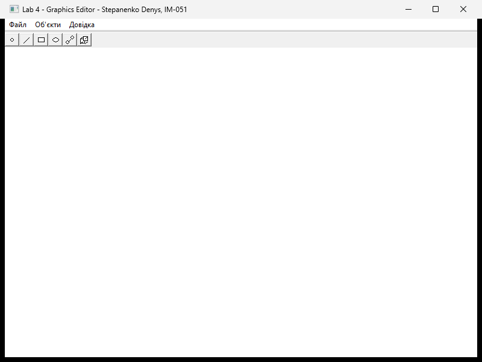
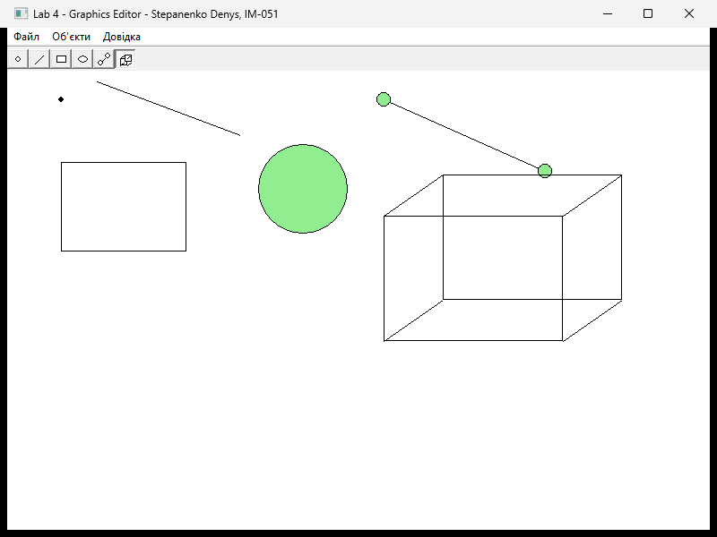
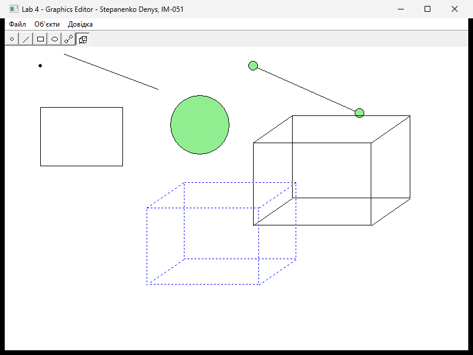

<div style="text-align: center; font-size: 24px; margin-top: 60px;">

Міністерство освіти і науки України

Національний технічний університет України

«Київський політехнічний інститут імені Ігоря Сікорського»

Факультет інформатики та обчислювальної техніки

Кафедра обчислювальної техніки

</div>

<div style="text-align: center; margin-top: 120px;">

<h1 style="font-size: 22px;">Лабораторна робота №4</h1>

<h2 style="font-size: 22px;">з дисципліни «Об'єктно-орієнтоване програмування»</h2>

<h3 style="font-size: 22px; margin-top: 20px;">на тему</h3>

<h2 style="font-size: 22px;">«Вдосконалення структури коду графічного редактора об'єктів»</h2>

</div>

<div style="text-align: right; margin-top: 120px; font-size: 18px;">

<strong>Виконав:</strong><br>
Степаненко Денис<br>
студент групи IM-051<br>
номер у списку групи: 13<br><br>

<strong>Перевірив:</strong><br>
Рекечинський Дмитро Олександрович

</div>

<div style="text-align: center; margin-top: 120px; font-size: 20px;">

Київ 2026

</div>

---

## Завдання

1. Створити у середовищі розробки проєкт з ім'ям Lab4.
2. Написати вихідний текст програми згідно варіанту завдання.
3. Скомпілювати вихідний текст і отримати виконуваний файл програми.
4. Перевірити роботу програми. Налагодити програму.
5. Проаналізувати та прокоментувати результати та вихідний текст програми.
6. Оформити звіт.

---

## Завдання згідно варіанту

Номер у списку групи: **13 (непарний)**

| Вимога | Реалізація |
|--------|-----------|
| Об'єкт редактора (непарний №) | **глобальний статичний** `static MyEditor g_editor;` |
| Кольори/стилі фігур | як у Lab 3 (rect — без заповнення, два кути; ellipse — світло-зелене заповнення, центр→кут) |
| «Гумовий» слід | **пунктирна** лінія для усіх фігур (`PS_DOT`) |
| Фігури з Lab2/3 | точка, лінія, прямокутник, еліпс |
| Нові фігури | **лінія з кружечками** (`LineOOShape`), **каркас куба** (`CubeShape`) |
| Спосіб реалізації нових | **множинне успадкування**: `LineShape+EllipseShape`, `LineShape+RectShape` |
| Делегування `Show()` | лінії → `LineShape::Show`, кружечки → `EllipseShape::Show`, грані куба → `RectShape::Show`, ребра → `LineShape::Show` |
| Toolbar | 6 кнопок-іконок з підказками, по одній на тип фігури |
| Звіт | діаграма класів, фрагменти коду, скріншоти, висновки |

---

## Структура програми

Програма продовжує графічний редактор Lab3. Бонусні інструменти Lab3
(трикутник, вибір, губка, діалог кольору) прибрано — умова Lab4 задає
рівно шість типів фігур і кнопку Toolbar для кожного типу.

| Файл | Призначення |
|------|-------------|
| `Lab4.cpp` | `WinMain`, `WndProc` — делегує повідомлення у глобальний статичний `g_editor` |
| `editor.h/.cpp` | клас `MyEditor`: стан редактора + обробники повідомлень |
| `toolbar.h/.cpp` | Toolbar: 6 іконок-кнопок, підказки |
| `shape.h/.cpp` | абстрактний `Shape` + спільні поля координат/кольорів/`m_penStyle` |
| `point.*`, `line.*`, `rect.*`, `ellipse.*` | базові фігури (Line/Rect/Ellipse — `virtual public Shape`) |
| `lineoo.*` | `LineOOShape : LineShape, EllipseShape` — лінія з кружечками |
| `cube.*` | `CubeShape : LineShape, RectShape` — каркас куба |
| `resource.h`, `Lab4.rc` | ідентифікатори команд, меню |

### Діаграма класів

```
                        ┌──────────────────┐
                        │    MyEditor      │
                        │ -pcshape[114]    │  0..*
                        │ -currentType     │─────── uses ───────┐
                        │ -pTempShape      │                    │
                        │ -hToolbar        │                    ▼
                        │ +OnCommand()     │          ┌──────────────────┐
                        │ +OnPaint() ...   │          │      Shape       │ «abstract»
                        └──────────────────┘          │ #x1,y1,x2,y2     │
                                                    │ #m_penColor      │
                                                    │ #m_fillColor     │
                                                    │ #m_penStyle      │
                                                    │ +Show(HDC) = 0   │
                                                    └─────────△────────┘
          ┌───────────────────┬─────────────────────┼─────────────────────┐
          │ «virtual»         │ «virtual»           │ «virtual»           │ (plain)
   ┌──────┴───────┐   ┌───────┴──────┐      ┌───────┴──────┐      ┌───────┴──────┐
   │  LineShape   │   │  RectShape   │      │ EllipseShape │      │  PointShape  │
   │ +Show()      │   │ +Show()      │      │ +Show()      │      │ +Show()      │
   └──────△───────┘   └───────△──────┘      └───────△──────┘      └──────────────┘
          │                   │                     │
          │   ┌───────────────┘                     │
          │   │                                     │
   ┌──────┴───┴────────┐                    ┌───────┴──────┐
   │   CubeShape       │                    │ LineOOShape  │◄───┐
   │ (Line+Rect)       │                    │ (Line+Ellipse)│    │
   │ Show = 2×RectShow │                    │ Show = Line   │    │
   │       + 4×LineShow│                    │  + 2×EllipseSh│    │
   └───────────────────┘                    └───────△──────┘    │
                    ▲                                 │         │
                    └─────────────── LineShape ───────┴─────────┘
                                     EllipseShape
```

Та сама ієрархія у вигляді двох ромбів:

```
   Ромб №1 — LineOOShape                Ромб №2 — CubeShape

        Shape                                Shape
       △     △                              △     △
 virtual     virtual                    virtual     virtual
       │     │                              │     │
  LineShape  EllipseShape              LineShape  RectShape
       △     △                              △     △
       └──┬──┘                              └──┬──┘
    LineOOShape                           CubeShape
```

Без `virtual` у кожному ромбі було би **два** примірники `Shape`
(координати `x1..y2` дублюються, `Show()` неоднозначний, приведення
`CubeShape*` → `Shape*` не компілюється). `virtual public Shape`
у `LineShape`/`RectShape`/`EllipseShape` лишає один спільний базовий
субоб'єкт; `PointShape` лишається звичайним успадкуванням —
він не є батьком жодного ромба.

---

## Ключові фрагменти коду

### Глобальний статичний об'єкт MyEditor (Lab4.cpp)

```cpp
static MyEditor g_editor;   // непарний варіант: статичний, не new/delete
```

Об'єкт створюється ще до `WinMain` (при старті програми), деструктор
спрацьовує при завершенні — ручне керування пам'яттю не потрібне.

### Множинне успадкування — лінія з кружечками (lineoo.h)

```cpp
class LineOOShape : public LineShape, public EllipseShape
{
public:
    LineOOShape(int x1 = 0, int y1 = 0, int x2 = 0, int y2 = 0)
        : Shape(x1, y1, x2, y2),        // most-derived ініціалізує virtual base
          LineShape(x1, y1, x2, y2),
          EllipseShape(x1, y1, x2, y2) {}
    void Show(HDC hdc) override;
};
```

### Делегування батьківським Show (lineoo.cpp)

```cpp
void LineOOShape::Show(HDC hdc)
{
    int ax1 = x1, ay1 = y1, ax2 = x2, ay2 = y2;   // зберігаємо спільні поля

    bool savedFill = m_hasFill;
    m_hasFill = false;              // лінія без заливки — чорний контур
    LineShape::Show(hdc);           // сама лінія
    m_hasFill = savedFill;

    // кружечки на кінцях — EllipseShape::Show (центр -> кут)
    x1 = ax1; y1 = ay1; x2 = ax1 + CIRCLE_R; y2 = ay1 + CIRCLE_R;
    EllipseShape::Show(hdc);
    x1 = ax2; y1 = ay2; x2 = ax2 + CIRCLE_R; y2 = ay2 + CIRCLE_R;
    EllipseShape::Show(hdc);

    x1 = ax1; y1 = ay1; x2 = ax2; y2 = ay2;       // відновлюємо
}
```

### Каркас куба (cube.cpp)

```cpp
void CubeShape::Show(HDC hdc)
{
    int ax1 = x1, ay1 = y1, ax2 = x2, ay2 = y2;
    int fx1 = min(ax1,ax2), fy1 = min(ay1,ay2);
    int fx2 = max(ax1,ax2), fy2 = max(ay1,ay2);
    int dx = (fx2-fx1)/3, dy = (fy2-fy1)/3;         // глибина — третина розміру

    x1 = fx1; y1 = fy1; x2 = fx2; y2 = fy2;
    RectShape::Show(hdc);                            // передня грань
    x1 = fx1+dx; y1 = fy1-dy; x2 = fx2+dx; y2 = fy2-dy;
    RectShape::Show(hdc);                            // задня грань (зміщена)

    // 4 ребра — LineShape::Show
    x1 = fx1; y1 = fy1; x2 = fx1+dx; y2 = fy1-dy; LineShape::Show(hdc);
    x1 = fx2; y1 = fy1; x2 = fx2+dx; y2 = fy1-dy; LineShape::Show(hdc);
    x1 = fx1; y1 = fy2; x2 = fx1+dx; y2 = fy2-dy; LineShape::Show(hdc);
    x1 = fx2; y1 = fy2; x2 = fx2+dx; y2 = fy2-dy; LineShape::Show(hdc);

    x1 = ax1; y1 = ay1; x2 = ax2; y2 = ay2;
}
```

### Пунктирний «гумовий» слід (shape.h + editor.cpp)

Стиль пера винесено в поле базового класу — усі `Show` створюють
`CreatePen(m_penStyle, ...)`:

```cpp
// Shape
int m_penStyle;                                  // PS_SOLID за замовчуванням
void SetPenStyle(int style) { m_penStyle = style; }

// MyEditor::OnLButtonDown — preview-об'єкт
pTempShape->SetPenColor(RGB(0, 0, 255));
pTempShape->SetPenStyle(PS_DOT);                 // пунктирний слід
pTempShape->ClearFill();
```

Поле живе у спільному `Shape`-субоб'єкті, тому при preview навіть
складені MI-фігури (лінія з кружечками, куб) цілком малюються пунктиром.

### Шість кнопок Toolbar (toolbar.cpp)

```cpp
#define BTN_COUNT 6
const int ids[BTN_COUNT] = { IDM_POINT, IDM_LINE, IDM_RECT,
                             IDM_ELLIPSE, IDM_LINEOO, IDM_CUBE };
```

Кожна кнопка — згенерована GDI-іконка 16×16 (для нових фігур намальовано
міні-гліфи: лінія з кружечками та каркас куба), `TBSTYLE_CHECKGROUP`,
підказки через `TTN_NEEDTEXT`.

---

## Результати роботи

### Головне вікно з Toolbar



_Рис. 1. Головне вікно: 6 кнопок-іконок (точка, лінія, прямокутник,
еліпс, лінія з кружечками, каркас куба), меню «Об'єкти» між «Файл»
та «Довідка»_

### Усі шість типів фігур



_Рис. 2. Об'єкти всіх типів: точка, лінія, прямокутник (без заливки),
еліпс (світло-зелене заповнення), лінія з кружечками на кінцях,
каркас куба (дві грані + ребра)_

### Пунктирний «гумовий» слід



_Рис. 3. Під час вводу каркасу куба preview малюється пунктирною
синьою лінією (`PS_DOT`) — усі частини складеної фігури пунктирні_

---

## Висновки

У лабораторній роботі виконано модернізацію структури коду графічного
редактора згідно варіанту (непарний №13): об'єкт редактора — глобальний
статичний `MyEditor g_editor`, «гумовий» слід усіх фігур — пунктирний
(`PS_DOT`), додано два нові типи фігур, реалізовані саме **множинним
успадкуванням**: `LineOOShape : LineShape, EllipseShape` та
`CubeShape : LineShape, RectShape`.

Ключова проблема — ромбовидне успадкування: у MI-класів `Shape`
усічається двічі (через обох батьків), що дублює поля координат і робить
`Show()` неоднозначним. Розв'язано віртуальним успадкуванням
`virtual public Shape` у проміжних класах — у MI-об'єктів існує один
спільний `Shape`-субоб'єкт, а most-derived клас ініціалізує його у
власному конструкторі. Делегування `LineShape::Show` /
`EllipseShape::Show` / `RectShape::Show` виконується з тимчасовою
підстановкою спільних полів координат — саме той прийом, який вимагає
методика.

Додано шосту кнопку Toolbar (міні-іконки для нових фігур малюються
GDI у бітмапи 16×16), оновлено меню «Об'єкти». Лабораторна дала навички
множинного успадкування, розв'язання diamond-проблеми через `virtual`,
та проєктування ієрархії, де нові фігури-комбінації складаються з
існуючих `Show` без дублювання коду.

---

## Контрольні запитання

**1. Що таке поліморфізм і як він використаний у цій роботі?**
Поліморфізм — здатність об'єктів різних класів відповідати на одне й те
саме повідомлення по-своєму. Масив `Shape* pcshape[]` зберігає вказівники
на об'єкти різних типів; виклик `pcshape[i]->Show(hdc)` поліморфно
диспетчеризується у конкретний `Show` через vtable. Те саме з
`OnMouseMove` при preview.

**2. Обробку яких повідомлень потрібно виконувати для вводу об'єктів?**
`WM_LBUTTONDOWN` (початок фігури + `SetCapture`), `WM_MOUSEMOVE`
(оновлення другого кута + `InvalidateRect` для preview),
`WM_LBUTTONUP` (фіксація фігури + `ReleaseCapture`), `WM_PAINT`
(перемалювання всіх об'єктів + гумового сліду), `WM_COMMAND`
(вибір типу з меню/тулбара), `WM_INITMENUPOPUP` (маркер типу в меню),
`WM_NOTIFY`/`TTN_NEEDTEXT` (підказки кнопок).

**3. Що таке абстрактний клас і скільки їх у цій програмі?**
Абстрактний клас — клас із хоча б одним чисто віртуальним методом;
об'єкти такого класу створити не можна. У програмі один абстрактний
клас — `Shape` (`virtual void Show(HDC) = 0`).

**4. Що таке множинне успадкування і як воно впливає на модульність?**
Множинне успадкування — клас успадковує два і більше батьків одночасно
(`class LineOOShape : public LineShape, public EllipseShape`).
Модульність зростає: нові фігури-комбінації збираються з готових
`Show` батьків без копіювання коду — додавання нового типу не вимагає
переписування існуючих модулів.

**5. Що таке ромбічне успадкування і які проблеми воно спричиняє?**
Ромб — коли клас має спільного предка двома шляхами:
`LineOOShape → LineShape → Shape` і `LineOOShape → EllipseShape → Shape`.
Без `virtual` об'єкт містить **два** `Shape`-субоб'єкти: поля `x1..y2`
дублюються, доступ до них неоднозначний (`ambiguous`), приведення до
`Shape*` не компілюється. Розв'язок — `virtual public Shape` у
проміжних класах: спільний базовий субоб'єкт один, а ініціалізує його
конструктор самого похідного класу.

**6. Як додати нові кнопки у Toolbar?**
Згенерувати іконку (тут — намалювати GDI у бітмапі 16×16), передати її
в тулбар повідомленням `TB_ADDBITMAP` (отримуємо індекс), додати
`TBBUTTON` з `iBitmap=idx`, `idCommand=IDM_новоїКоманди`,
`fsStyle=TBSTYLE_CHECKGROUP` повідомленням `TB_ADDBUTTONS`, додати текст
підказки у `ToolTipText()` і пункт у меню «Об'єкти» з тим самим ID —
тоді кнопка й пункт меню працюють через спільний `WM_COMMAND`.
