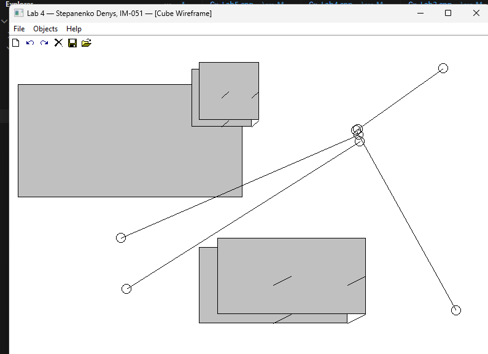

<div style="text-align: center; font-size: 24px; margin-top: 60px;">

Міністерство освіти і науки України

Національний технічний університет України

«Київський політехнічний інститут імені Ігоря Сікорського»

Факультет інформатики та обчислювальної техніки

Кафедра обчислювальної техніки

</div>

<div style="text-align: center; margin-top: 120px;">

<h1 style="font-size: 22px;">Лабораторна робота №4</h1>

<h2 style="font-size: 22px;">з дисципліни «Об'єктно-орієнтоване програмування»</h2>

<h3 style="font-size: 22px; margin-top: 20px;">на тему</h3>

<h2 style="font-size: 22px;">«Вдосконалення структури коду графічного редактора об'єктів на C++»</h2>

</div>

<div style="text-align: right; margin-top: 120px; font-size: 18px;">

<strong>Виконав:</strong><br>
Степаненко Денис<br>
студент групи IM-051<br>
номер у списку групи: 16<br><br>

<strong>Перевірив:</strong><br>
Рекечинський Дмитро Олександрович

</div>

<div style="text-align: center; margin-top: 120px; font-size: 20px;">

Київ 2026

</div>

---

## Завдання

1. Створити у середовищі MS Visual Studio C++ проєкт Win32 з ім'ям Lab4.
2. Написати вихідний текст програми згідно варіанту завдання.
3. Скомпілювати вихідний текст і отримати виконуваний файл програми.
4. Перевірити роботу програми. Налагодити програму.
5. Проаналізувати та прокоментувати результати та вихідний текст програми.

---

## Завдання згідно варіанту

Номер у списку: **Ж = 16 (парне)**

- **Динамічний об'єкт MyEditor** — створюється через `new` у `WM_CREATE`, видаляється через `delete` у `WM_DESTROY`
- **"Гумовий" слід — пунктирна лінія** (`PS_DASH`)
- Усі кольори та стилі фігур як у Lab3
- Додано дві нові фігури через **множинне успадкування**:
  - **LineWithCircles** — успадковує `LineShape` + `EllipseShape`
  - **CubeWireframe** — успадковує `LineShape` + `RectShape`
- Toolbar з 6 кнопками та підказками для кожного типу

---

## Вихідний текст програми

### Головний файл Lab4.cpp

```cpp
#include <windows.h>
#include <commctrl.h>
#include <tchar.h>
#include "resource.h"
#include "my_editor.h"

#pragma comment(lib, "comctl32.lib")

static MyEditor* g_pEditor = NULL;

static const TCHAR* ShapeNames[] = {
    _T("Point"), _T("Line"), _T("Rectangle"), _T("Ellipse"),
    _T("Line w/ Circles"), _T("Cube Wireframe")
};

LRESULT CALLBACK WndProc(HWND hWnd, UINT message, WPARAM wParam, LPARAM lParam)
{
    static HWND hToolBar = NULL;

    switch (message)
    {
    case WM_CREATE:
    {
        g_pEditor = new MyEditor();  // dynamic object (J=16 even)

        hToolBar = CreateWindowEx(0, TOOLBARCLASSNAME, NULL,
            WS_CHILD | WS_VISIBLE | TBSTYLE_FLAT | TBSTYLE_TOOLTIPS,
            0, 0, 0, 0, hWnd, (HMENU)IDR_TOOLBAR,
            ((LPCREATESTRUCT)lParam)->hInstance, NULL);

        // ... toolbar setup with 6 buttons ...

        g_pEditor->SelectShape(IDM_POINT);
    }
    break;

    case WM_COMMAND:
    {
        int wmId = LOWORD(wParam);
        switch (wmId)
        {
        case IDM_POINT: case IDM_LINE: case IDM_RECT:
        case IDM_ELLIPSE: case IDM_LINECIRC: case IDM_CUBE:
            g_pEditor->SelectShape(wmId);
            UpdateTitle(hWnd, wmId);
            break;
        // ...
        }
    }
    break;

    case WM_LBUTTONDOWN: g_pEditor->OnMouseDown(LOWORD(lParam), HIWORD(lParam)); break;
    case WM_MOUSEMOVE:   g_pEditor->OnMouseMove(LOWORD(lParam), HIWORD(lParam), hWnd); break;
    case WM_LBUTTONUP:   g_pEditor->OnMouseUp(LOWORD(lParam), HIWORD(lParam)); InvalidateRect(hWnd, NULL, TRUE); break;
    case WM_PAINT:       { PAINTSTRUCT ps; HDC hdc = BeginPaint(hWnd, &ps); g_pEditor->OnPaint(hdc); EndPaint(hWnd, &ps); } break;
    case WM_DESTROY:     delete g_pEditor; g_pEditor = NULL; PostQuitMessage(0); break;
    // ...
    }
    return 0;
}
```

### Клас MyEditor — my_editor.h / my_editor.cpp

```cpp
// my_editor.h
#pragma once
#include <windows.h>
#include "shape.h"

#define N 117

class MyEditor
{
private:
    Shape* pcshape[N];
    int shapeCount;
    int currentType;
    bool isDrawing;
    Shape* pTempShape;

    Shape* CreateShape(int type, int x1, int y1, int x2, int y2);

public:
    MyEditor();
    ~MyEditor();

    void OnMouseDown(int x, int y);
    void OnMouseMove(int x, int y, HWND hWnd);
    void OnMouseUp(int x, int y);
    void OnPaint(HDC hdc);
    void SelectShape(int type) { currentType = type; }
};

// my_editor.cpp
Shape* MyEditor::CreateShape(int type, int x1, int y1, int x2, int y2)
{
    switch (type)
    {
    case IDM_POINT:    return new PointShape(x1, y1, x2, y2);
    case IDM_LINE:     return new LineShape(x1, y1, x2, y2);
    case IDM_RECT:     return new RectShape(x1, y1, x2, y2);
    case IDM_ELLIPSE:  return new EllipseShape(x1, y1, x2, y2);
    case IDM_LINECIRC: return new LineWithCircles(x1, y1, x2, y2);
    case IDM_CUBE:     return new CubeWireframe(x1, y1, x2, y2);
    default:           return nullptr;
    }
}

void MyEditor::OnPaint(HDC hdc)
{
    for (int i = 0; i < shapeCount; i++)
        if (pcshape[i]) pcshape[i]->Show(hdc);

    if (isDrawing && pTempShape)
    {
        int oldROP = SetROP2(hdc, R2_NOTXORPEN);
        HPEN hPen = CreatePen(PS_DASH, 1, RGB(0, 0, 0));  // dashed rubber band
        HPEN hOldPen = (HPEN)SelectObject(hdc, hPen);
        pTempShape->Show(hdc);
        SelectObject(hdc, hOldPen);
        SetROP2(hdc, oldROP);
        DeleteObject(hPen);
    }
}
```

### Клас LineWithCircles — linecircles.h (множинне успадкування)

```cpp
#pragma once
#include "line.h"
#include "ellipse.h"

class LineWithCircles : public LineShape, public EllipseShape
{
public:
    LineWithCircles(int x1=0, int y1=0, int x2=0, int y2=0)
        : LineShape(x1, y1, x2, y2), EllipseShape(x1, y1, x2, y2) {}

    void Show(HDC hdc) override
    {
        LineShape::Show(hdc);  // draw the line

        // Draw circles at both endpoints
        EllipseShape circle1(x1 - 8, y1 - 8, x1 + 8, y1 + 8);
        circle1.Show(hdc);

        EllipseShape circle2(x2 - 8, y2 - 8, x2 + 8, y2 + 8);
        circle2.Show(hdc);
    }

    void OnMouseDown(int x, int y) override { LineShape::OnMouseDown(x, y); }
    void OnMouseMove(int x, int y) override { LineShape::OnMouseMove(x, y); }
    void GetCoords(int& a, int& b, int& c, int& d) const { LineShape::GetCoords(a, b, c, d); }
};
```

### Клас CubeWireframe — cube.h (множинне успадкування)

```cpp
#pragma once
#include "line.h"
#include "rect.h"

class CubeWireframe : public LineShape, public RectShape
{
public:
    CubeWireframe(int x1=0, int y1=0, int x2=0, int y2=0)
        : LineShape(x1, y1, x2, y2), RectShape(x1, y1, x2, y2) {}

    void Show(HDC hdc) override
    {
        // Front face
        RectShape front(x1, y1, x2, y2);
        front.Show(hdc);

        // Isometric offset for back face
        int dx = (x2 - x1) / 4;
        int dy = (y2 - y1) / 4;

        // Back face
        RectShape back(x1 + dx, y1 - dy, x2 + dx, y2 - dy);
        back.Show(hdc);

        // Connecting edges
        LineShape edge1(x1, y1, x1 + dx, y1 - dy);  edge1.Show(hdc);
        LineShape edge2(x2, y1, x2 + dx, y1 - dy);  edge2.Show(hdc);
        LineShape edge3(x2, y2, x2 + dx, y2 - dy);  edge3.Show(hdc);
        LineShape edge4(x1, y2, x1 + dx, y2 - dy);  edge4.Show(hdc);
    }

    void OnMouseDown(int x, int y) override { RectShape::OnMouseDown(x, y); }
    void OnMouseMove(int x, int y) override { RectShape::OnMouseMove(x, y); }
    void GetCoords(int& a, int& b, int& c, int& d) const { RectShape::GetCoords(a, b, c, d); }
};
```

---

## Діаграми

### Діаграма залежностей файлів та модулів

```
Lab4.cpp
├── <windows.h>
├── <commctrl.h>
├── <tchar.h>
├── resource.h
└── my_editor.h
    └── shape.h

my_editor.cpp
├── my_editor.h
├── point.h     → shape.h
├── line.h      → shape.h
├── rect.h      → shape.h
├── ellipse.h   → shape.h
├── linecircles.h → line.h + ellipse.h
├── cube.h        → line.h + rect.h
└── resource.h

linecircles.h
├── line.h      → shape.h
└── ellipse.h   → shape.h

cube.h
├── line.h      → shape.h
└── rect.h      → shape.h
```

### Діаграма класів (UML)

```
┌─────────────────────────────┐
│      Shape (abstract)       │
├─────────────────────────────┤
│ # x1, y1, x2, y2: int       │
├─────────────────────────────┤
│ + Shape(x1,y1,x2,y2)        │
│ + virtual ~Shape()          │
│ + virtual Show(HDC) = 0     │
│ + virtual OnMouseDown(x,y)  │
│ + virtual OnMouseMove(x,y)  │
│ + GetCoords(a,b,c,d)        │
└──────────────┬──────────────┘
               │ extends
   ┌───────────┼───────────┬───────────────┐
   │           │           │               │
┌──▼──────┐ ┌──▼──────┐ ┌──▼───────┐ ┌────▼──────┐
│PointShape│ │LineShape│ │RectShape │ │EllipseShp │
├──────────┤ ├──────────┤ ├──────────┤ ├───────────┤
│+Show(HDC)│ │+Show(HDC)│ │+Show(HDC)│ │+Show(HDC) │
│  SetPixel│ │  MoveTo  │ │  Rectang │ │  Ellipse  │
│          │ │  LineTo  │ │  gray    │ │  no fill  │
└────┬─────┘ └────┬─────┘ └────┬─────┘ └─────┬─────┘
     │            │            │             │
     │      ┌─────┘      ┌─────┘             │
     │      │            │                   │
     │      ▼            ▼                   │
     │   ┌──────────────────┐  ┌──────────────────┐
     │   │ LineWithCircles  │  │ CubeWireframe    │
     │   │ : LineShape,     │  │ : LineShape,     │
     │   │   EllipseShape   │  │   RectShape      │
     │   ├──────────────────┤  ├──────────────────┤
     │   │ + Show(HDC)      │  │ + Show(HDC)      │
     │   │   Line + 2 circ  │  │   front + back   │
     │   │   at endpoints   │  │   + 4 edges      │
     │   │ + OnMouseDown()  │  │ + OnMouseDown()  │
     │   │ + OnMouseMove()  │  │ + OnMouseMove()  │
     │   │ + GetCoords()    │  │ + GetCoords()    │
     │   └──────────────────┘  └──────────────────┘
     │
     │  ┌──────────────────────────────┐
     │  │        MyEditor              │
     │  ├──────────────────────────────┤
     │  │ - pcshape[N]: Shape*         │
     │  │ - shapeCount: int            │
     │  │ - currentType: int           │
     │  │ - isDrawing: bool            │
     │  │ - pTempShape: Shape*         │
     │  ├──────────────────────────────┤
     │  │ + OnMouseDown(x, y)          │
     │  │ + OnMouseMove(x, y, hWnd)    │
     │  │ + OnMouseUp(x, y)            │
     │  │ + OnPaint(hdc)               │
     │  │ + SelectShape(type)          │
     │  │ + CreateShape(type, ...)     │  ← factory method
     │  └──────────────┬───────────────┘
     │                 │ manages Shape*
     └─────────────────┘
```

---

## Скріншоти

### Головне вікно з Toolbar (6 кнопок)



_Рис. 1. Головне вікно з Toolbar з 6 кнопками та меню_

---

### Малювання лінії з кружечками


_Рис. 2. Фігура «лінія з кружечками» (LineWithCircles — множинне успадкування)_

---

### Малювання каркаса куба


_Рис. 3. Фігура «каркас куба» (CubeWireframe — множинне успадкування)_

---

### Усі 6 типів фігур


_Рис. 4. Усі 6 типів фігур: крапка, лінія, прямокутник, еліпс, лінія з кружечками, каркас куба_

---

### Toolbar з підказкою


_Рис. 5. Toolbar з підказкою (tooltip) при наведенні на кнопку_

---

## Висновки

У лабораторній роботі я виконав завдання згідно свого варіанту (Ж = 16, парне). Виконано рефакторинг коду: логіка графічного редактора винесена в окремий клас `MyEditor`, який створюється динамічно через `new` у `WM_CREATE` та видаляється через `delete` у `WM_DESTROY`. `WndProc` тепер лише делегує виклики методам `MyEditor`.

Додано дві нові фігури через множинне успадкування:
- **LineWithCircles** успадковує `LineShape` та `EllipseShape` — малює лінію з кружечками на кінцях
- **CubeWireframe** успадковує `LineShape` та `RectShape` — малює каркас куба в ізометричній проєкції

Множинне успадкування реалізовано з вирішенням проблеми неоднозначності через явну вказівку базового класу: `LineShape::Show(hdc)`, `RectShape::Show(hdc)`.

"Гумовий" слід змінено на пунктирний (`PS_DASH`) згідно вимоги лабораторної роботи. Toolbar розширено до 6 кнопок з підказками.

Лабораторна робота дала практичні навички рефакторингу, множинного успадкування, вирішення неоднозначностей при множинному успадкуванні, та інкапсуляції логіки в окремий клас.
