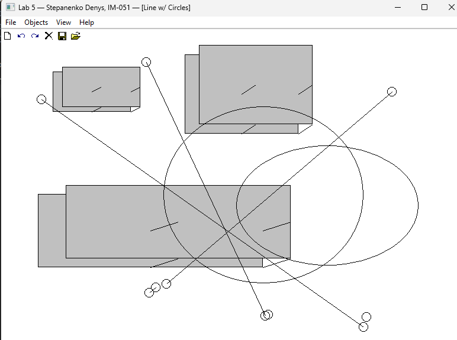

<div style="text-align: center; font-size: 24px; margin-top: 60px;">

Міністерство освіти і науки України

Національний технічний університет України

«Київський політехнічний інститут імені Ігоря Сікорського»

Факультет інформатики та обчислювальної техніки

Кафедра обчислювальної техніки

</div>

<div style="text-align: center; margin-top: 120px;">

<h1 style="font-size: 22px;">Лабораторна робота №5</h1>

<h2 style="font-size: 22px;">з дисципліни «Об'єктно-орієнтоване програмування»</h2>

<h3 style="font-size: 22px; margin-top: 20px;">на тему</h3>

<h2 style="font-size: 22px;">«Багатовіконний інтерфейс користувача на C++»</h2>

</div>

<div style="text-align: right; margin-top: 120px; font-size: 18px;">

<strong>Виконав:</strong><br>
Степаненко Денис<br>
студент групи IM-051<br>
номер у списку групи: 16<br><br>

<strong>Перевірив:</strong><br>
Рекечинський Дмитро Олександрович

</div>

<div style="text-align: center; margin-top: 120px; font-size: 20px;">

Київ 2026

</div>

---

## Завдання

1. Створити у середовищі MS Visual Studio C++ проєкт Win32 з ім'ям Lab5.
2. Написати вихідний текст програми згідно варіанту завдання.
3. Скомпілювати вихідний текст і отримати виконуваний файл програми.
4. Перевірити роботу програми. Налагодити програму.
5. Проаналізувати та прокоментувати результати та вихідний текст програми.

---

## Завдання згідно варіанту

Номер у списку: **Ж = 16 (парне)**

- **Класична реалізація Singleton** — статичний вказівник `p_instance`, метод `getInstance()` з перевіркою `if (!p_instance) p_instance = new MyEditor()`
- **Незалежний модуль `my_table`** — окремий клас `MyTable` зі своїм `.rc` файлом, не залежить від інших модулів проєкту (не включає їхні `.h` файли)
- **Немодальне вікно таблиці** — `CreateDialog` замість `DialogBox`, обробка через `IsDialogMessage` у циклі повідомлень
- **Запис об'єктів у файл** — tab-separated формат: `назва\tx1\ty1\tx2\ty2`
- Усі фігури та Toolbar з Lab4 збережено

---

## Вихідний текст програми

### Головний файл Lab5.cpp

```cpp
#include <windows.h>
#include <commctrl.h>
#include <tchar.h>
#include "resource.h"
#include "my_editor.h"
#include "my_table.h"

static MyTable table;
static HINSTANCE g_hInst = NULL;

LRESULT CALLBACK WndProc(HWND hWnd, UINT message, WPARAM wParam, LPARAM lParam)
{
    static HWND hToolBar = NULL;

    switch (message)
    {
    case WM_CREATE:
        // ... toolbar setup ...
        MyEditor::getInstance()->SelectShape(IDM_POINT);
        break;

    case WM_COMMAND:
    {
        int wmId = LOWORD(wParam);
        switch (wmId)
        {
        case IDM_POINT: /* ... */ case IDM_CUBE:
            MyEditor::getInstance()->SelectShape(wmId);
            break;
        case IDM_VIEW_TABLE:
            table.Activate(hWnd, g_hInst);  // non-modal table window
            break;
        case IDM_FILE_SAVE:
            MyEditor::getInstance()->SaveToFile(L"shapes.txt");
            MessageBox(hWnd, _T("Saved to shapes.txt"), _T("File"), MB_OK);
            break;
        // ...
        }
    }
    break;

    case WM_LBUTTONUP:
    {
        MyEditor* editor = MyEditor::getInstance();
        int prevCount = editor->GetCount();
        editor->OnMouseUp(LOWORD(lParam), HIWORD(lParam));

        // Add to table if new shape was added
        if (editor->GetCount() > prevCount && table.IsActive())
        {
            Shape* s = editor->GetShape(editor->GetCount() - 1);
            if (s)
            {
                const wchar_t* name = GetShapeNameW(s);
                int x1, y1, x2, y2;
                s->GetCoords(x1, y1, x2, y2);
                table.Add(name, x1, y1, x2, y2);
            }
        }
        InvalidateRect(hWnd, NULL, TRUE);
    }
    break;

    // ...
    }

    // Message loop with IsDialogMessage for non-modal table
    while (GetMessage(&msg, NULL, 0, 0))
    {
        if (!IsDialogMessage(table.GetHwnd(), &msg))
        {
            TranslateMessage(&msg);
            DispatchMessage(&msg);
        }
    }
}
```

### Клас MyEditor (Singleton) — my_editor.h

```cpp
#pragma once
#include <windows.h>
#include "shape.h"

#define N 117

class MyEditor
{
private:
    static MyEditor* p_instance;
    Shape* pcshape[N];
    int shapeCount;
    int currentType;
    bool isDrawing;
    Shape* pTempShape;

    MyEditor();
    MyEditor(const MyEditor&) = delete;
    MyEditor& operator=(const MyEditor&) = delete;

    Shape* CreateShape(int type, int x1, int y1, int x2, int y2);

public:
    ~MyEditor();
    static MyEditor* getInstance();

    void OnMouseDown(int x, int y);
    void OnMouseMove(int x, int y, HWND hWnd);
    void OnMouseUp(int x, int y);
    void OnPaint(HDC hdc);
    void SelectShape(int type) { currentType = type; }
    int  GetCount() const { return shapeCount; }
    Shape* GetShape(int i) const { return (i >= 0 && i < shapeCount) ? pcshape[i] : NULL; }

    void SaveToFile(const wchar_t* filename);
};
```

### MyEditor — my_editor.cpp (Singleton + SaveToFile)

```cpp
MyEditor* MyEditor::p_instance = nullptr;

MyEditor* MyEditor::getInstance()
{
    if (!p_instance)
        p_instance = new MyEditor();
    return p_instance;
}

void MyEditor::SaveToFile(const wchar_t* filename)
{
    FILE* fout;
    if (_wfopen_s(&fout, filename, L"wt") != 0 || !fout) return;

    for (int i = 0; i < shapeCount; i++)
    {
        const wchar_t* name = L"Unknown";
        if (dynamic_cast<PointShape*>(pcshape[i])) name = L"Point";
        else if (dynamic_cast<LineShape*>(pcshape[i])) name = L"Line";
        else if (dynamic_cast<RectShape*>(pcshape[i])) name = L"Rect";
        else if (dynamic_cast<EllipseShape*>(pcshape[i])) name = L"Ellipse";
        else if (dynamic_cast<LineWithCircles*>(pcshape[i])) name = L"LineCirc";
        else if (dynamic_cast<CubeWireframe*>(pcshape[i])) name = L"Cube";

        int x1, y1, x2, y2;
        pcshape[i]->GetCoords(x1, y1, x2, y2);
        fwprintf(fout, L"%s\t%d\t%d\t%d\t%d\n", name, x1, y1, x2, y2);
    }
    fclose(fout);
}
```

### Незалежний модуль MyTable — my_table.h / my_table.cpp

```cpp
// my_table.h — independent module (no project dependencies)
#pragma once
#include <windows.h>

class MyTable
{
private:
    HWND hDlg;
    HWND hList;
    int rowCount;

public:
    MyTable();
    ~MyTable();

    void Activate(HWND hParent, HINSTANCE hInst);
    void Close();
    void Add(const wchar_t* name, int x1, int y1, int x2, int y2);
    void Clear();
    bool IsActive() const { return hDlg != NULL; }
    HWND GetHwnd() const { return hDlg; }
    void SetHwnd(HWND hwnd);
};

#define IDD_TABLE_DIALOG  500
#define IDC_TABLE_LIST    501

// my_table.cpp
void MyTable::Activate(HWND hParent, HINSTANCE hInst)
{
    if (hDlg) { Close(); return; }
    g_pTable = this;
    hDlg = CreateDialog(hInst, MAKEINTRESOURCE(IDD_TABLE_DIALOG),
                        hParent, TableDlgProc);  // non-modal
}

void MyTable::Add(const wchar_t* name, int x1, int y1, int x2, int y2)
{
    if (!hList) return;
    wchar_t buf[256];
    swprintf_s(buf, 256, L"%s\t%d\t%d\t%d\t%d", name, x1, y1, x2, y2);
    SendMessageW(hList, LB_ADDSTRING, 0, (LPARAM)buf);
    rowCount++;
    SendMessageW(hList, LB_SETTOPINDEX, rowCount - 1, 0);  // auto-scroll
}
```

---

## Діаграми

### Діаграма залежностей файлів та модулів

```
Lab5.cpp
├── <windows.h>
├── <commctrl.h>
├── <tchar.h>
├── resource.h
├── my_editor.h
│   └── shape.h
└── my_table.h
    └── <windows.h>

my_editor.cpp
├── my_editor.h
├── point.h, line.h, rect.h, ellipse.h
├── linecircles.h, cube.h
└── resource.h

my_table.cpp
└── my_table.h           ← НЕ залежить від інших модулів проєкту

my_table.rc
└── my_table.h           ← ресурс IDs
```

**Важливо:** модуль `my_table` не включає жодних `.h` файлів проєкту окрім власного — повна незалежність.

### Діаграма класів (UML)

```
┌──────────────────────────────┐
│   MyEditor (Singleton)       │
├──────────────────────────────┤
│ - p_instance: static MyEd*   │  ← lazy init
│ - pcshape[N]: Shape*         │
│ - shapeCount: int            │
│ - currentType: int           │
│ - isDrawing: bool            │
│ - pTempShape: Shape*         │
├──────────────────────────────┤
│ - MyEditor()                 │  ← private ctor
│ - MyEditor(const&) = delete  │  ← no copy
│ - operator=(const&) = delete │  ← no assign
├──────────────────────────────┤
│ + getInstance(): MyEditor*   │  ← if(!p) p=new MyEd
│ + OnMouseDown(x, y)          │
│ + OnMouseMove(x, y, hWnd)    │
│ + OnMouseUp(x, y)            │
│ + OnPaint(hdc)               │  ← dashed rubber band
│ + SelectShape(type)          │
│ + GetCount(): int            │
│ + GetShape(i): Shape*        │
│ + SaveToFile(filename)       │  ← tab-separated
│ + CreateShape(type, ...)     │  ← factory
└──────────────┬───────────────┘
               │ manages Shape*
               ▼
┌─────────────────────────────┐
│      Shape (abstract)       │
├─────────────────────────────┤
│ # x1, y1, x2, y2: int       │
│ + Show(HDC) = 0             │
│ + OnMouseDown(x,y)          │
│ + OnMouseMove(x,y)          │
└──────────────┬──────────────┘
               │
   ┌───────────┼───────────┬──────────┐
   │           │           │          │
┌──▼──────┐ ┌──▼──────┐ ┌──▼──────┐ ┌─▼────────┐
│PointShape│ │LineShape│ │RectShape│ │EllipseShp│
└──────────┘ └────┬────┘ └────┬────┘ └─────┬────┘
                  │           │             │
            ┌─────┘     ┌─────┘             │
            ▼           ▼                   │
   ┌──────────────┐  ┌──────────────┐      │
   │LineWithCirc  │  │CubeWireframe │      │
   │: Line+Ellip  │  │: Line+Rect   │      │
   └──────────────┘  └──────────────┘      │
                                          │
┌──────────────────────────────┐          │
│        MyTable               │          │
├──────────────────────────────┤          │
│ - hDlg: HWND                 │          │
│ - hList: HWND                │          │
│ - rowCount: int              │          │
├──────────────────────────────┤          │
│ + Activate(parent, inst)     │ ← CreateDialog (non-modal)
│ + Close()                    │ ← DestroyWindow
│ + Add(name, x1,y1,x2,y2)     │ ← LB_ADDSTRING
│ + Clear()                    │ ← LB_RESETCONTENT
│ + IsActive(): bool           │
│ + GetHwnd(): HWND            │
│ + SetHwnd(hwnd)              │
└──────────────────────────────┘
     ↑ НЕ залежить від Shape/MyEditor
```

---

## Скріншоти

### Головне вікно з меню View/Table



_Рис. 1. Головне вікно з меню «View → Table» та «File → Save»_

---

### Немодальне вікно таблиці


_Рис. 2. Немодальне вікно таблиці об'єктів (listbox з координатами)_

---

### Головне вікно + таблиця одночасно


_Рис. 3. Багатовіконний інтерфейс — головне вікно та таблиця одночасно_

---

### Збереження у файл


_Рис. 4. Збереження об'єктів у файл shapes.txt (tab-separated)_

---

## Висновки

У лабораторній роботі я виконав завдання згідно свого варіанту (Ж = 16, парне). Реалізовано класичний патерн Singleton для класу `MyEditor` — приватний конструктор, статичний вказівник `p_instance`, метод `getInstance()` з лінивою ініціалізацією. Копіювання та присвоєвання заборонено через `= delete`.

Створено незалежний модуль `my_table` — клас `MyTable` зі своїм файлом ресурсів `.rc`, що не залежить від інших модулів проєкту. Немодальне вікно таблиці створюється через `CreateDialog` і обробляється через `IsDialogMessage` у головному циклі повідомлень — це дозволяє працювати з обома вікнами одночасно.

Додано запис об'єктів у файл у tab-separated форматі: `назва\tx1\ty1\tx2\ty2`. Тип об'єкта визначається через `dynamic_cast`.

Лабораторна робота дала практичні навички використання патерну Singleton, створення незалежних модулів, роботи з немодальними діалоговими вікнами, та запису даних у файл.
