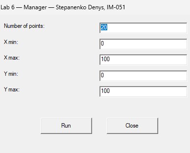
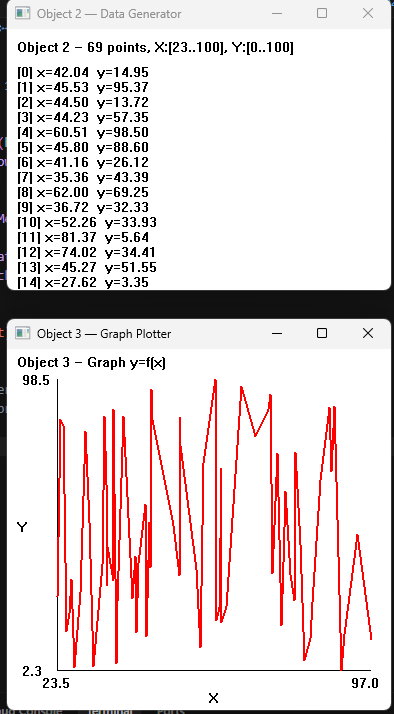

<div style="text-align: center; font-size: 24px; margin-top: 60px;">

Міністерство освіти і науки України

Національний технічний університет України

«Київський політехнічний інститут імені Ігоря Сікорського»

Факультет інформатики та обчислювальної техніки

Кафедра обчислювальної техніки

</div>

<div style="text-align: center; margin-top: 120px;">

<h1 style="font-size: 22px;">Лабораторна робота №6</h1>

<h2 style="font-size: 22px;">з дисципліни «Об'єктно-орієнтоване програмування»</h2>

<h3 style="font-size: 22px; margin-top: 20px;">на тему</h3>

<h2 style="font-size: 22px;">«Програмна система з компонентами для обробки даних»</h2>

</div>

<div style="text-align: right; margin-top: 120px; font-size: 18px;">

<strong>Виконав:</strong><br>
Степаненко Денис<br>
студент групи IM-051<br>
номер у списку групи: 16<br><br>

<strong>Перевірив:</strong><br>
Рекечинський Дмитро Олександрович

</div>

<div style="text-align: center; margin-top: 120px; font-size: 20px;">

Київ 2026

</div>

---

## Завдання

1. Створити у середовищі MS Visual Studio C++ проєкт Win32 з ім'ям Lab6.
2. Написати вихідний текст програми згідно варіанту завдання.
3. Скомпілювати вихідний текст і отримати виконуваний файл програми.
4. Перевірити роботу програми. Налагодити програму.
5. Проаналізувати та прокоментувати результати та вихідний текст програми.

---

## Завдання згідно варіанту

Номер у списку: **Ж = 16, варіант = Ж mod 4 = 0**

Три незалежні програми, що обмінюються даними через `WM_COPYDATA` та Clipboard:

- **Lab6 (Менеджер)** — користувач вводить параметри: `nPoint`, `xMin`, `xMax`, `yMin`, `yMax`. Менеджер запускає Object2 та Object3 через `WinExec`, розташовує вікна на екрані, передає параметри через `WM_COPYDATA`.
- **Object2 (Генератор даних)** — генерує `nPoint` випадкових пар (x, y) у заданих діапазонах, відображає значення у вікні, записує дані у Clipboard (CF_TEXT, tab-separated), повідомляє Object3 через `PostMessage(WM_USER+100)`.
- **Object3 (Побудова графіка)** — читає дані з Clipboard, сортує за x, малює графік y=f(x) з осями координат та підписами.

---

## Вихідний текст програми

### Програма Lab6.cpp (Менеджер)

```cpp
struct Lab6Params {
    int nPoint;
    int xMin, xMax;
    int yMin, yMax;
    HWND hWndSender;
};

static void LaunchPrograms(HWND hWnd)
{
    // Build paths to Object2.exe and Object3.exe
    TCHAR path2[MAX_PATH], path3[MAX_PATH];
    GetModuleFileName(NULL, path2, MAX_PATH);
    TCHAR* p = _tcsrchr(path2, _T('\\'));
    if (p) *p = 0;
    _stprintf_s(path3, MAX_PATH, _T("%s\\Object2.exe"), path2);
    // ... similar for Object3

    // Check if already running
    hObj2 = FindWindow(_T("Object2Class"), NULL);
    hObj3 = FindWindow(_T("Object3Class"), NULL);

    if (!hObj2) WinExec(cmd2, SW_SHOWNORMAL);
    if (!hObj3) WinExec(cmd3, SW_SHOWNORMAL);

    // Wait for windows to appear
    for (int i = 0; i < 50; i++)
    {
        if (!hObj2) hObj2 = FindWindow(_T("Object2Class"), NULL);
        if (!hObj3) hObj3 = FindWindow(_T("Object3Class"), NULL);
        if (hObj2 && hObj3) break;
        Sleep(100);
    }

    // Position windows on screen
    MoveWindow(hObj2, 520, 50, 400, 300, TRUE);
    MoveWindow(hObj3, 520, 370, 400, 400, TRUE);
    MoveWindow(hWnd, 50, 50, 450, 350, TRUE);
}

static void SendParams(HWND hWnd)
{
    Lab6Params params;
    // Read from edit controls
    params.nPoint = _ttoi(buf);  // etc.

    // Send to Object2 via WM_COPYDATA
    if (hObj2)
    {
        COPYDATASTRUCT cds;
        cds.dwData = 0;
        cds.cbData = sizeof(Lab6Params);
        cds.lpData = &params;
        SendMessage(hObj2, WM_COPYDATA, (WPARAM)hWnd, (LPARAM)&cds);
    }
}
```

### Програма Object2.cpp (Генератор даних)

```cpp
static void GenerateData()
{
    g_count = g_params.nPoint;
    g_x = new double[g_count];
    g_y = new double[g_count];

    srand((unsigned)time(NULL));
    for (int i = 0; i < g_count; i++)
    {
        double rx = (double)rand() / RAND_MAX;
        double ry = (double)rand() / RAND_MAX;
        g_x[i] = g_params.xMin + rx * (g_params.xMax - g_params.xMin);
        g_y[i] = g_params.yMin + ry * (g_params.yMax - g_params.yMin);
    }
    InvalidateRect(g_hWnd, NULL, TRUE);
}

static void WriteToClipboard()
{
    // Format: "x\ty\n" per line
    char* buf = new char[g_count * 32];
    int pos = 0;
    for (int i = 0; i < g_count; i++)
        pos += sprintf_s(buf + pos, ..., "%.2f\t%.2f\n", g_x[i], g_y[i]);

    HGLOBAL hglb = GlobalAlloc(GMEM_MOVEABLE, pos + 1);
    memcpy(GlobalLock(hglb), buf, pos + 1);
    GlobalUnlock(hglb);
    OpenClipboard(g_hWnd);
    EmptyClipboard();
    SetClipboardData(CF_TEXT, hglb);
    CloseClipboard();

    // Notify Object3
    HWND hObj3 = FindWindow(_T("Object3Class"), NULL);
    if (hObj3)
        PostMessage(hObj3, WM_USER + 100, 0, 0);
}

// Handler:
case WM_COPYDATA:
{
    COPYDATASTRUCT* cds = (COPYDATASTRUCT*)lParam;
    if (cds && cds->cbData == sizeof(Lab6Params))
    {
        memcpy(&g_params, cds->lpData, sizeof(Lab6Params));
        GenerateData();
        WriteToClipboard();
    }
}
```

### Програма Object3.cpp (Побудова графіка)

```cpp
#define WM_CLIPBOARD_NOTIFY (WM_USER + 100)

static void ReadFromClipboard()
{
    OpenClipboard(g_hWnd);
    HGLOBAL hglb = GetClipboardData(CF_TEXT);
    char* text = (char*)GlobalLock(hglb);

    // Parse "x\ty\n" lines
    int lines = 0;
    // ... count lines, allocate arrays, parse values

    GlobalUnlock(hglb);
    CloseClipboard();

    // Sort by x (ascending)
    for (int i = 0; i < g_count - 1; i++)
        for (int j = i + 1; j < g_count; j++)
            if (g_x[j] < g_x[i]) { /* swap */ }

    InvalidateRect(g_hWnd, NULL, TRUE);
}

// In WM_PAINT: draw axes + graph line
case WM_PAINT:
{
    // Find min/max ranges
    // Draw X axis (bottom), Y axis (left)
    // Draw axis labels (xMin, xMax, yMin, yMax)
    // Draw graph: red line connecting sorted points
    for (int i = 0; i < g_count; i++)
    {
        int px = ml + (int)((g_x[i] - xMin) / (xMax - xMin) * gw);
        int py = mt + gh - (int)((g_y[i] - yMin) / (yMax - yMin) * gh);
        if (i == 0) MoveToEx(hdc, px, py, NULL);
        else         LineTo(hdc, px, py);
    }
}
```

---

## Діаграми

### Діаграма залежностей файлів та модулів

```
Lab6/
├── Lab6.cpp          ← (standalone, only <windows.h>)
├── Lab6.rc           ← dialog resource

Object2/
├── Object2.cpp       ← (standalone, only <windows.h>)
└── (no .rc needed — simple window)

Object3/
├── Object3.cpp       ← (standalone, only <windows.h>)
└── (no .rc needed — simple window)
```

Усі три програми — **повністю незалежні**. Жодних спільних `.h` файлів. Зв'язок між ними — лише через `WM_COPYDATA`, `Clipboard` та `PostMessage`.

### Діаграма компонентів системи

```
┌──────────────┐   WinExec    ┌──────────────┐
│   Lab6       │─────────────▶│   Object2    │
│  (Manager)   │              │ (Data Gen)   │
│              │  WM_COPYDATA │              │
│  FindWindow  │─────────────▶│  Generate    │
│  SendMessage │              │  Clipboard   │
│              │              └──────┬───────┘
│              │                     │
│              │              PostMessage
│              │              WM_USER+100
│              │                     │
│              │              ┌──────▼───────┐
│              │              │   Object3    │
│              │              │ (Graph)      │
│              │              │  Read Clip   │
│              │              │  Draw Graph  │
└──────────────┘              └──────────────┘
```

### Схема послідовності обміну повідомленнями

```
Lab6                Object2              Object3
  │                    │                    │
  │ WinExec            │                    │
  │───────────────────▶│                    │
  │                    │                    │
  │ WM_COPYDATA        │                    │
  │  (nPoint, ranges)  │                    │
  │───────────────────▶│                    │
  │                    │                    │
  │                    │ GenerateData()     │
  │                    │ WriteToClipboard() │
  │                    │                    │
  │                    │ PostMessage        │
  │                    │ WM_USER+100        │
  │                    │───────────────────▶│
  │                    │                    │
  │                    │           ReadFromClipboard()
  │                    │           Sort by x
  │                    │           InvalidateRect()
  │                    │                    │
  │                    │           WM_PAINT
  │                    │           Draw graph
```

---

## Скріншоти

### Вікно менеджера Lab6



_Рис. 1. Вікно менеджера Lab6 — ввод параметрів nPoint, xMin, xMax, yMin, yMax_

---

### Три вікна одночасно



_Рис. 2. Три вікна одночасно: менеджер (зліва), Object2 (справа вгорі), Object3 (справа внизу)_

---

### Object2 — згенеровані дані


_Рис. 3. Програма Object2 — список згенерованих пар (x, y)_

---

### Object3 — графік y=f(x)


_Рис. 4. Програма Object3 — графік y=f(x) з осями координат та підписами_

---

## Висновки

У лабораторній роботі я виконав завдання згідно свого варіанту (Ж = 16, варіант 0). Створено програмну систему з трьох незалежних програм, що обмінюються даними через механізми Windows API.

**Lab6 (Менеджер)** запускає Object2 та Object3 через `WinExec`, знаходить їхні вікна через `FindWindow` за ім'ям класу, передає параметри через `WM_COPYDATA` зі структурою `COPYDATASTRUCT`, та розташовує вікна на екрані через `MoveWindow`.

**Object2 (Генератор)** приймає параметри через `WM_COPYDATA`, генерує випадкові пари (x, y) у заданих діапазонах, записує їх у Clipboard у форматі `CF_TEXT` (tab-separated), та повідомляє Object3 через `PostMessage(WM_USER+100)`.

**Object3 (Графік)** отримує повідомлення-notify, читає дані з Clipboard, сортує за x, малює графік y=f(x) з осями координат, підписами меж та лінією графіка.

Лабораторна робота дала практичні навички розробки багатопрограмних систем, використання `WM_COPYDATA` для передачі даних між процесами, роботи з Clipboard (`OpenClipboard`, `SetClipboardData`, `GetClipboardData`), та координації вікон через `FindWindow` і `PostMessage`.
