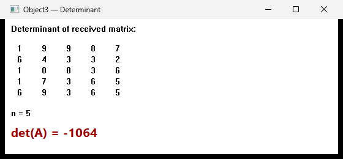
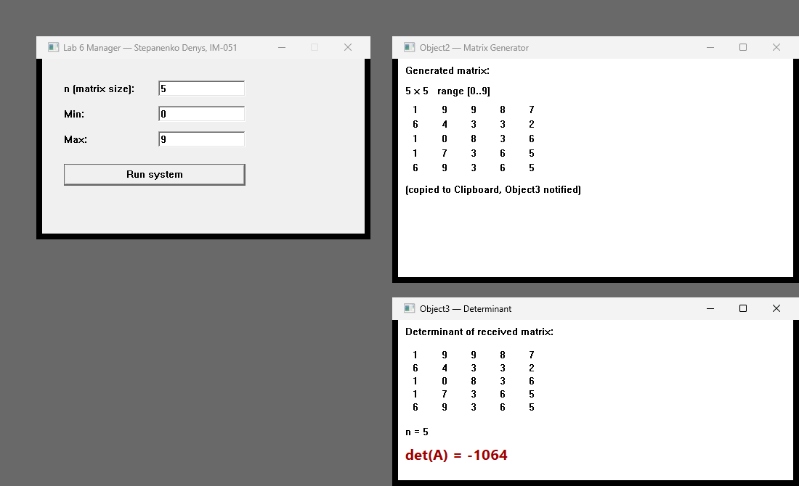

<div style="text-align: center; font-size: 24px; margin-top: 60px;">

Міністерство освіти і науки України

Національний технічний університет України

«Київський політехнічний інститут імені Ігоря Сікорського»

Факультет інформатики та обчислювальної техніки

Кафедра обчислювальної техніки

</div>

<div style="text-align: center; margin-top: 120px;">

<h1 style="font-size: 22px;">Лабораторна робота №6</h1>

<h2 style="font-size: 22px;">з дисципліни «Об'єктно-орієнтоване програмування»</h2>

<h3 style="font-size: 22px; margin-top: 20px;">на тему</h3>

<h2 style="font-size: 22px;">«Програмна система з компонентами для обробки даних»</h2>

</div>

<div style="text-align: right; margin-top: 120px; font-size: 18px;">

<strong>Виконав:</strong><br>
Степаненко Денис<br>
студент групи IM-051<br>
номер у списку групи: 13<br><br>

<strong>Перевірив:</strong><br>
Рекечинський Дмитро Олександрович

</div>

<div style="text-align: center; margin-top: 120px; font-size: 20px;">

Київ 2026

</div>

---

## Завдання

1. Створити у середовищі MS Visual Studio C++ проєкт Win32 з ім'ям Lab6.
2. Написати вихідний текст програми згідно варіанту завдання.
3. Скомпілювати вихідний текст і отримати виконуваний файл програми.
4. Перевірити роботу програми. Налагодити програму.
5. Проаналізувати та прокоментувати результати та вихідний текст програми.

---

## Завдання згідно варіанту

Номер у списку: **Ж = 13**, варіант **Ж mod 4 = 1**

Програмна система з **трьох незалежних програм-компонентів**, які
обмінюються даними виключно через механізми Windows API
(жодних спільних файлів чи заголовків):

| Програма | Роль | Вхід | Вихід |
|---|---|---|---|
| **Lab6** | Менеджер | поля `n`, `Min`, `Max` | запуск дочірніх програм (`WinExec`), розміщення вікон (`MoveWindow`), параметри через `WM_COPYDATA` |
| **Object2** | Генератор матриці | `WM_COPYDATA` зі структурою параметрів | матриця `n×n` цілих у `[Min..Max]` → Clipboard `CF_TEXT` → `PostMessage` сповіщення Object3 |
| **Object3** | Детермінант | `WM_USER+100` → читання Clipboard | обчислення `det(A)` методом Гауса, вивід матриці та результату |

Схема взаємодії:

```
┌──────────┐   WinExec    ┌──────────┐  CF_TEXT   ┌────────────┐
│   Lab6   │─────────────►│ Object2  │═══════════►│  Clipboard │
│ Manager  │              │ Matrix   │            └─────┬──────┘
│          │ WM_COPYDATA ─►│ Generator│                  │ GetClipboardData
│          │  (n,Min,Max)  │          │  WM_USER+100     ▼
│          │              │          │─────────────►┌──────────┐
└──────────┘              └──────────┘  PostMessage  │ Object3  │
                                                     │   Det    │
                                                     └──────────┘
```

Формат даних у Clipboard: перший рядок — розмірність `n`, далі `n`
рядків матриці з tab-separated цілими значеннями.

---

## Вихідний текст програми

### Lab6.cpp — програма-менеджер

```cpp
// Lab6.cpp — Manager program (J=13, variant 1)
// Launches Object2/Object3, positions windows, sends params via WM_COPYDATA.
// Stepanenko Denys, IM-051, 2026

#include <windows.h>
#include <tchar.h>
#include <stdio.h>

// Params block shared over WM_COPYDATA (each program defines its own copy —
// programs are fully independent, no shared headers).
struct Lab6Params
{
    int n;              // matrix dimension n×n
    int minVal, maxVal; // element range
    HWND hWndSender;    // manager hwnd — children may answer back
};

#define IDC_ED_N     201
#define IDC_ED_MIN   202
#define IDC_ED_MAX   203
#define IDC_BTN_RUN  210

static HWND hEdN, hEdMin, hEdMax;
static HWND hObj2 = NULL, hObj3 = NULL;

static TCHAR szWindowClass[] = _T("Lab6ManagerClass");
static TCHAR szTitle[] = _T("Lab 6 Manager — Stepanenko Denys, IM-051");

static HWND MakeEdit(HWND hWnd, int x, int y, int w, int id, const TCHAR* def)
{
    HWND h = CreateWindowEx(WS_EX_CLIENTEDGE, _T("EDIT"), def,
        WS_CHILD | WS_VISIBLE | WS_TABSTOP | ES_AUTOHSCROLL,
        x, y, w, 22, hWnd, (HMENU)(INT_PTR)id, NULL, NULL);
    return h;
}

static void MakeLabel(HWND hWnd, int x, int y, const TCHAR* text)
{
    CreateWindow(_T("STATIC"), text, WS_CHILD | WS_VISIBLE | SS_LEFT,
        x, y + 3, 120, 18, hWnd, NULL, NULL, NULL);
}

static void LaunchPrograms(HWND hWnd)
{
    // Object2.exe / Object3.exe — same dir as Lab6.exe, or sibling src folders
    TCHAR self[MAX_PATH], dir[MAX_PATH];
    GetModuleFileName(NULL, self, MAX_PATH);
    lstrcpy(dir, self);
    TCHAR* p = _tcsrchr(dir, _T('\\'));
    if (p) *p = 0;

    TCHAR cmd2[MAX_PATH * 2], cmd3[MAX_PATH * 2];

    hObj2 = FindWindow(_T("Object2Class"), NULL);
    hObj3 = FindWindow(_T("Object3Class"), NULL);

    // WinExec is ANSI-only — convert command lines explicitly
    char cmdA[MAX_PATH * 2];
    if (!hObj2)
    {
        _stprintf_s(cmd2, MAX_PATH * 2, _T("\"%ls\\Object2.exe\""), dir);
        WideCharToMultiByte(CP_ACP, 0, cmd2, -1, cmdA, sizeof(cmdA), NULL, NULL);
        if (WinExec(cmdA, SW_SHOWNORMAL) <= 31)   // fallback: sibling build dir
        {
            _stprintf_s(cmd2, MAX_PATH * 2, _T("\"%ls\\..\\Object2\\Object2.exe\""), dir);
            WideCharToMultiByte(CP_ACP, 0, cmd2, -1, cmdA, sizeof(cmdA), NULL, NULL);
            WinExec(cmdA, SW_SHOWNORMAL);
        }
    }
    if (!hObj3)
    {
        _stprintf_s(cmd3, MAX_PATH * 2, _T("\"%ls\\Object3.exe\""), dir);
        WideCharToMultiByte(CP_ACP, 0, cmd3, -1, cmdA, sizeof(cmdA), NULL, NULL);
        if (WinExec(cmdA, SW_SHOWNORMAL) <= 31)
        {
            _stprintf_s(cmd3, MAX_PATH * 2, _T("\"%ls\\..\\Object3\\Object3.exe\""), dir);
            WideCharToMultiByte(CP_ACP, 0, cmd3, -1, cmdA, sizeof(cmdA), NULL, NULL);
            WinExec(cmdA, SW_SHOWNORMAL);
        }
    }

    // wait for their windows to register
    for (int i = 0; i < 50 && (!hObj2 || !hObj3); i++)
    {
        if (!hObj2) hObj2 = FindWindow(_T("Object2Class"), NULL);
        if (!hObj3) hObj3 = FindWindow(_T("Object3Class"), NULL);
        if (hObj2 && hObj3) break;
        Sleep(100);
    }

    // arrange: manager left, matrix top-right, determinant bottom-right
    MoveWindow(hWnd,  50,  50, 460, 280, TRUE);
    if (hObj2) MoveWindow(hObj2, 540,  50, 560, 340, TRUE);
    if (hObj3) MoveWindow(hObj3, 540, 410, 560, 260, TRUE);
}

static void SendParams(HWND hWnd)
{
    TCHAR buf[64];
    Lab6Params params;

    GetWindowText(hEdN,   buf, 64); params.n      = _ttoi(buf);
    GetWindowText(hEdMin, buf, 64); params.minVal = _ttoi(buf);
    GetWindowText(hEdMax, buf, 64); params.maxVal = _ttoi(buf);
    params.hWndSender = hWnd;

    if (params.n <= 0)  params.n = 5;
    if (params.n > 20)  params.n = 20;          // display keeps it sane
    if (params.maxVal <= params.minVal) params.maxVal = params.minVal + 1;

    if (!hObj2) hObj2 = FindWindow(_T("Object2Class"), NULL);
    if (!hObj3) hObj3 = FindWindow(_T("Object3Class"), NULL);

    if (!hObj2)
    {
        MessageBox(hWnd, _T("Object2 window not found — run the system first"),
            _T("Lab6"), MB_OK | MB_ICONWARNING);
        return;
    }

    COPYDATASTRUCT cds;
    cds.dwData = 0;
    cds.cbData = sizeof(Lab6Params);
    cds.lpData = &params;
    SendMessage(hObj2, WM_COPYDATA, (WPARAM)hWnd, (LPARAM)&cds);
}

LRESULT CALLBACK WndProc(HWND hWnd, UINT message, WPARAM wParam, LPARAM lParam)
{
    switch (message)
    {
    case WM_CREATE:
        MakeLabel(hWnd, 30, 30,  _T("n (matrix size):"));
        MakeLabel(hWnd, 30, 65,  _T("Min:"));
        MakeLabel(hWnd, 30, 100, _T("Max:"));
        hEdN   = MakeEdit(hWnd, 160, 30,  120, IDC_ED_N,   _T("5"));
        hEdMin = MakeEdit(hWnd, 160, 65,  120, IDC_ED_MIN, _T("0"));
        hEdMax = MakeEdit(hWnd, 160, 100, 120, IDC_ED_MAX, _T("9"));
        CreateWindow(_T("BUTTON"), _T("Run system"),
            WS_CHILD | WS_VISIBLE | BS_DEFPUSHBUTTON,
            30, 145, 250, 30, hWnd, (HMENU)IDC_BTN_RUN, NULL, NULL);
        break;

    case WM_COMMAND:
        if (LOWORD(wParam) == IDC_BTN_RUN)
        {
            LaunchPrograms(hWnd);
            SendParams(hWnd);
        }
        break;

    case WM_DESTROY:
        // polite shutdown: children close together with the manager
        if (hObj2) PostMessage(hObj2, WM_CLOSE, 0, 0);
        if (hObj3) PostMessage(hObj3, WM_CLOSE, 0, 0);
        PostQuitMessage(0);
        break;

    default:
        return DefWindowProc(hWnd, message, wParam, lParam);
    }
    return 0;
}

int APIENTRY _tWinMain(HINSTANCE hInstance, HINSTANCE hPrevInstance,
                       LPTSTR lpCmdLine, int nCmdShow)
{
    UNREFERENCED_PARAMETER(hPrevInstance);
    UNREFERENCED_PARAMETER(lpCmdLine);

    WNDCLASSEX wcex;
    wcex.cbSize        = sizeof(WNDCLASSEX);
    wcex.style         = CS_HREDRAW | CS_VREDRAW;
    wcex.lpfnWndProc   = WndProc;
    wcex.cbClsExtra    = 0;
    wcex.cbWndExtra    = 0;
    wcex.hInstance     = hInstance;
    wcex.hIcon         = LoadIcon(NULL, IDI_APPLICATION);
    wcex.hCursor       = LoadCursor(NULL, IDC_ARROW);
    wcex.hbrBackground = (HBRUSH)(COLOR_BTNFACE + 1);
    wcex.lpszMenuName  = NULL;
    wcex.lpszClassName = szWindowClass;
    wcex.hIconSm       = LoadIcon(NULL, IDI_APPLICATION);
    RegisterClassEx(&wcex);

    HWND hWnd = CreateWindow(szWindowClass, szTitle,
        WS_OVERLAPPED | WS_CAPTION | WS_SYSMENU | WS_MINIMIZEBOX,
        50, 50, 460, 280, NULL, NULL, hInstance, NULL);
    if (!hWnd) return 1;

    ShowWindow(hWnd, nCmdShow);
    UpdateWindow(hWnd);

    MSG msg;
    while (GetMessage(&msg, NULL, 0, 0))
    {
        TranslateMessage(&msg);
        DispatchMessage(&msg);
    }
    return (int)msg.wParam;
}
```

### Object2.cpp — генератор матриці

```cpp
// Object2.cpp — Matrix generator program (J=13, variant 1)
// Receives Lab6Params via WM_COPYDATA, generates n×n int matrix in [Min..Max],
// shows it in the window, writes CF_TEXT to Clipboard, notifies Object3.
// Stepanenko Denys, IM-051, 2026

#include <windows.h>
#include <tchar.h>
#include <stdio.h>
#include <stdlib.h>
#include <time.h>
#include <string.h>

struct Lab6Params
{
    int n;
    int minVal, maxVal;
    HWND hWndSender;
};

#define WM_DATA_READY (WM_USER + 100)   // Object2 -> Object3 notification

static TCHAR szWindowClass[] = _T("Object2Class");
static TCHAR szTitle[] = _T("Object2 — Matrix Generator");
static HWND  g_hWnd = NULL;

static Lab6Params g_params = { 0, 0, 0, NULL };
static int*  g_matrix = NULL;   // flat n×n
static int   g_n = 0;

static void GenerateMatrix()
{
    delete[] g_matrix; g_matrix = NULL;
    g_n = g_params.n;
    if (g_n <= 0) return;

    g_matrix = new int[g_n * g_n];

    srand((unsigned)time(NULL));
    int span = g_params.maxVal - g_params.minVal + 1;
    for (int i = 0; i < g_n * g_n; i++)
        g_matrix[i] = g_params.minVal + rand() % span;

    InvalidateRect(g_hWnd, NULL, TRUE);
}

static void WriteToClipboard()
{
    if (g_n <= 0 || !g_matrix) return;

    // format: first line = n, then n rows of tab-separated ints
    int cap = g_n * g_n * 12 + 64;
    char* buf = new char[cap];
    int pos = sprintf_s(buf, cap, "%d\n", g_n);
    for (int r = 0; r < g_n; r++)
    {
        for (int c = 0; c < g_n; c++)
            pos += sprintf_s(buf + pos, cap - pos, "%d\t", g_matrix[r * g_n + c]);
        pos += sprintf_s(buf + pos, cap - pos, "\n");
    }

    HGLOBAL hglb = GlobalAlloc(GMEM_MOVEABLE, pos + 1);
    if (!hglb) { delete[] buf; return; }
    char* dst = (char*)GlobalLock(hglb);
    memcpy(dst, buf, pos + 1);
    GlobalUnlock(hglb);
    delete[] buf;

    if (OpenClipboard(g_hWnd))
    {
        EmptyClipboard();
        SetClipboardData(CF_TEXT, hglb);   // clipboard owns hglb now
        CloseClipboard();
    }
    else
        GlobalFree(hglb);
}

static void NotifyObject3()
{
    HWND hObj3 = FindWindow(_T("Object3Class"), NULL);
    if (hObj3)
        PostMessage(hObj3, WM_DATA_READY, 0, 0);
}

LRESULT CALLBACK WndProc(HWND hWnd, UINT message, WPARAM wParam, LPARAM lParam)
{
    switch (message)
    {
    case WM_CREATE:
        g_hWnd = hWnd;
        break;

    case WM_COPYDATA:
    {
        COPYDATASTRUCT* cds = (COPYDATASTRUCT*)lParam;
        if (cds && cds->cbData == sizeof(Lab6Params))
        {
            memcpy(&g_params, cds->lpData, sizeof(Lab6Params));
            GenerateMatrix();
            WriteToClipboard();
            NotifyObject3();
        }
        return TRUE;
    }

    case WM_PAINT:
    {
        PAINTSTRUCT ps;
        HDC hdc = BeginPaint(hWnd, &ps);

        SetBkMode(hdc, TRANSPARENT);
        TextOut(hdc, 10, 8, _T("Generated matrix:"), 17);

        TCHAR line[128];
        if (g_n == 0)
        {
            TextOut(hdc, 10, 36, _T("waiting for params from Lab6 manager..."), 38);
        }
        else
        {
            _stprintf_s(line, 128, _T("%d x %d   range [%d..%d]"),
                g_n, g_n, g_params.minVal, g_params.maxVal);
            TextOut(hdc, 10, 36, line, (int)_tcslen(line));

            // draw the matrix as a grid, cells ~40×20 px
            int cellW = 40, cellH = 20, top = 62, left = 20;
            for (int r = 0; r < g_n; r++)
                for (int c = 0; c < g_n; c++)
                {
                    _stprintf_s(line, 128, _T("%d"), g_matrix[r * g_n + c]);
                    TextOut(hdc, left + c * cellW, top + r * cellH,
                        line, (int)_tcslen(line));
                }
            TextOut(hdc, 10, top + g_n * cellH + 10,
                _T("(copied to Clipboard, Object3 notified)"), 39);
        }
        EndPaint(hWnd, &ps);
        break;
    }

    case WM_DESTROY:
        delete[] g_matrix;
        PostQuitMessage(0);
        break;

    default:
        return DefWindowProc(hWnd, message, wParam, lParam);
    }
    return 0;
}

int APIENTRY _tWinMain(HINSTANCE hInstance, HINSTANCE hPrevInstance,
                       LPTSTR lpCmdLine, int nCmdShow)
{
    UNREFERENCED_PARAMETER(hPrevInstance);
    UNREFERENCED_PARAMETER(lpCmdLine);

    WNDCLASSEX wcex;
    wcex.cbSize        = sizeof(WNDCLASSEX);
    wcex.style         = CS_HREDRAW | CS_VREDRAW;
    wcex.lpfnWndProc   = WndProc;
    wcex.cbClsExtra    = 0;
    wcex.cbWndExtra    = 0;
    wcex.hInstance     = hInstance;
    wcex.hIcon         = LoadIcon(NULL, IDI_APPLICATION);
    wcex.hCursor       = LoadCursor(NULL, IDC_ARROW);
    wcex.hbrBackground = (HBRUSH)(COLOR_WINDOW + 1);
    wcex.lpszMenuName  = NULL;
    wcex.lpszClassName = szWindowClass;
    wcex.hIconSm       = LoadIcon(NULL, IDI_APPLICATION);
    RegisterClassEx(&wcex);

    HWND hWnd = CreateWindow(szWindowClass, szTitle, WS_OVERLAPPEDWINDOW,
        540, 50, 560, 340, NULL, NULL, hInstance, NULL);
    if (!hWnd) return 1;

    ShowWindow(hWnd, nCmdShow);
    UpdateWindow(hWnd);

    MSG msg;
    while (GetMessage(&msg, NULL, 0, 0))
    {
        TranslateMessage(&msg);
        DispatchMessage(&msg);
    }
    return (int)msg.wParam;
}
```

### Object3 — детермінант



_Рис. 3. Object3 прочитав матрицю 5×5 з Clipboard, обчислив детермінант методом Гауса і вивів det(A) = −1064_

---

### Всі три вікна системи



_Рис. 4. Загальний вигляд: менеджер ліворуч вводить параметри, справа зверху — матриця, справа знизу — детермінант_

---

## Висновки

У лабораторній роботі я виконав завдання згідно свого варіанту (Ж = 13,
варіант 1) — створив програмну систему з трьох незалежних програм, які
обмінюються даними через механізми Windows API.

Програма-менеджер **Lab6** має поля вводу параметрів `n`, `Min`, `Max`,
запускає дочірні програми через `WinExec` і передає параметри
повідомленням `WM_COPYDATA`. **Object2** генерує квадратну матрицю
`n×n` цілих чисел у діапазоні `[Min..Max]`, показує її у вікні та
записує у буфер обміну у форматі `CF_TEXT`, після чого сповіщає
**Object3** повідомленням `WM_USER+100`. **Object3** читає матрицю з
буфера обміну, обчислює детермінант методом Гауса з частковим вибором
головного елемента і відображає результат у вікні. Обчислене значення
`det(A)` перевірено незалежно (NumPy) — результат збігається.

Принципові моменти реалізації — зв'язок даними: спершу дані
розміщуються у Clipboard, і лише тоді надходить повідомлення; у момент
читання буфер обміну може бути зайнятий іншою програмою, тому читання
повторюється, а `strtok_s` працює на власній копії буфера.

Лабораторна робота дала практичні навички міжпроцесної взаємодії у
Windows: `WM_COPYDATA` для передачі структур, Clipboard API
(`GlobalAlloc`/`SetClipboardData`/`GetClipboardData`) для обміну текстом,
та `PostMessage` для асинхронного сповіщення про готовність даних.
